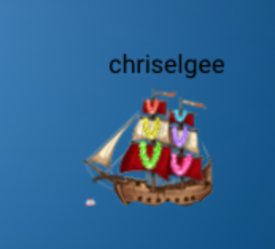
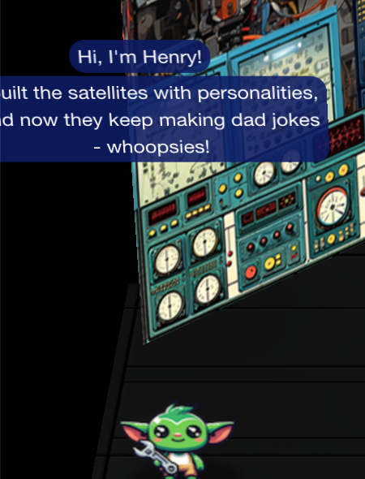
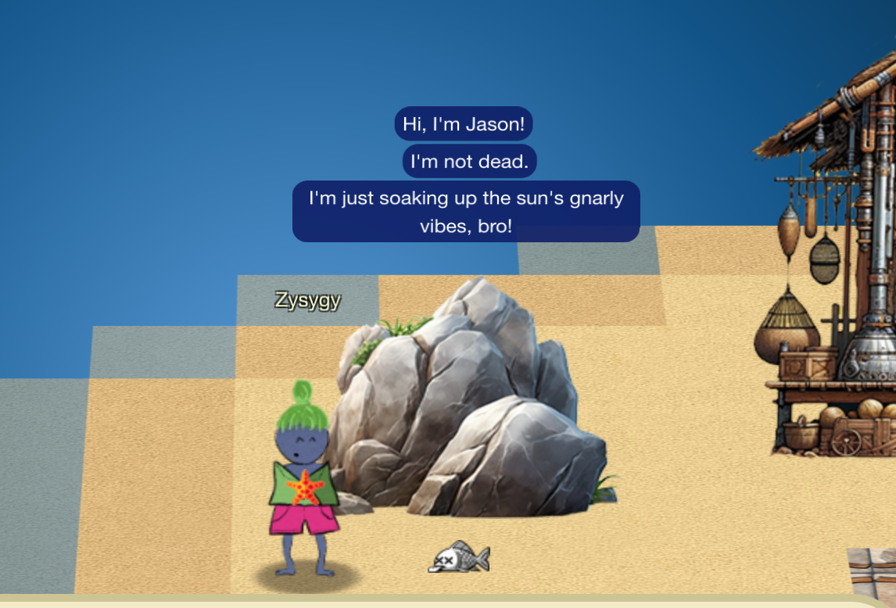
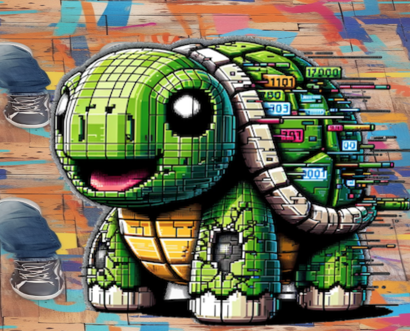

# Easter Eggs

## NaaN

The JavaScript code in the Naan challenge is wild. I guess Shifty looked a little different originally?

```javascript
//card = this.add.image(screenCenterX, screenCenterY, 'card').setOrigin(0.5, 0.5)
        //card.scale = 0.1;
        //NotAnOrcElfTalking.anims.play('arms');
        /*
        dvoraks.on('animationcomplete', function() {
            //dvoraks.setFrame(0)
        });
        cyberdroids.setVisible(false)
                explosion.setFrame(10)
        explosion.setAlpha(0.75)
        t1 = this.tweens.create({
            targets: [dvoraks,cyberdroids,smithereens],
            angle: '+=1',
            //x: '+=100',
            //y: '+=0',
            duration: 400,
            completeDelay: 0,
            onComplete: function () {
                t2.play()
            },
        })
        dvoraks_DialogueBox = createTextBox(this, screenCenterX, 12+(DialogueBoxHeight/2), {
                wrapWidth: 500,
                fixedWidth: 500,
                fixedHeight: 65,
            }).start(dvoraks_content, 20);
        */

       /*
function talk() {
    NotAnOrcElfTalking.setVisible(true)
    NotAnOrcElfArms.setVisible(false)
    NotAnOrcElfTalking.anims.play('talking');
}
*/

/*function TalkAnimation(alien_obj, time=5000) {
    alien_obj.anims.play(alien_obj.aname+'_talk');
    setTimeout(()=>{
        alien_obj.anims.stop();
        alien_obj.anims.play(alien_obj.aname+'_idle');
    }, time)
}*/

/*
var check_state = function() {
    $.post("action", {"check_state": "check_state"}, function(response){
        if (response.smithereens !== undefined && response.smithereens === true) {
            EndGame()
        } else if (response.cyberdroids !== undefined && response.cyberdroids === true) {
            alien_death(dvoraks)
            setTimeout(()=>{
                alien_death(cyberdroids)
            }, 2000)
        } else if (response.dvoraks !== undefined && response.dvoraks === true) {
            alien_death(dvoraks)
        }
    }).fail(function(response) {
        console.error(response.status+': '+ response.responseJSON.data)
    });    
}
var submit_answer = function(value) {
    $.post("action", {"answer": value}, function(response){
        if (response.data !== undefined) {
            console.log( response.data )
            DialogueResponse(response)
        }
    }).fail(function(response) {
        console.error(response.status+': '+ response.responseJSON.data)
    });
}
*/
```

The images:


## Active Directory
The contents of todo.txt
1. Bake some cookies.
2. Restrict access to C:\FileShare\super_secret_research to only researchers so everyone cant see the folder or read its contents
3. Profit

There were also some PDFs:
* [Cookies_Recipe.pdf](./img/easter_eggs/Cookies_Recipe.pdf)
* [Cookies.pdf](./img/easter_eggs/Cookies.pdf)
* [Signature_Cookies.pdf](./img/easter_eggs/Signature_Cookies.pdf)

## Staff




## The Art and Music

The various art and music included in this year's holiday hack was top notch. I want to put a special shout out to the song based on [Rock Me Armadeus](https://en.wikipedia.org/wiki/Rock_Me_Amadeus) and the Turtle Toy

