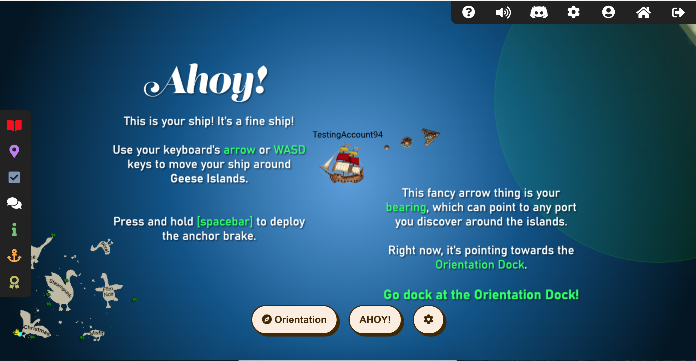

# Welcome to The 2023 SANS Holiday Hack Challenge: A Holiday Odyssey. Featuring 6: Geese A-Lei'ing

## Introduction

I think this year was probably my favourite year of KringleCon. The wide variety of challenges was amazing; from the trivial (cheating on games) all the way through to what must be one of the most expensive and dangerous type of attack (interfering with satellite operations). None of the challenges felt too contrived to me and the vibe of the game brought back so much nostalgia from my childhood (I really wish I'd known how to break into locker locks when I was in high school!). Huge thanks to everyone involved in making this possible!

Unfortunately, I think this year is also my worst write-up (apart from my very first when I didn't realise I was meant to do a write-up until the due date and hadn't kept any notes or anything). A couple of big (fortunately positive) life events meant I didn't have much time or energy to spend on this this year. If you're wondering why I don't talk much about my missteps, please be assured that it's not because I didn't make *a lot*, it's just that I didn't have time to chronical them.

Normally I really enjoy the community-vibe for the Holiday Hack but the time limits meant I didn't get involved much this year. Thanks so much to @coopreme, @Dzhernikov, @devastati0n, @Voldetort and @chacho for giving me hints when I felt like there was no hope of solving the challenges in time.
I also want to give a special thanks to Crahan for the template - I'm not sure I would've completed this writeup without it.

Links to each of the objectives are on the left, and below. I didn't have time to complete the Bonus Fishing Challenge, unfortunately. I've also linked to some [Easter eggs](./easter_eggs.md), but haven't had a chance to write much about them.

!!! note "50-page submission limit"
    Each year there's a huge number of write-ups that need to be reviewed by the Counter Hack team. To find a good middle ground between preventing information overload and creating a write-up that can stand on its own as a learning resource, some parts, like the *navigation tip* below, are collapsed by default. Skipping over these will not take away from understanding the overall solution, but feel free to expand them to get some additional information.

??? tip "Navigation tip"
    Even with less than 50 pages, there's still quite a bit of information to read through. To make things a little easier, you can use ++"P"++ or ++","++ to go to the previous section, ++"N"++ or ++"."++ to navigate to the next section, and ++"S"++, ++"F"++, or ++"/"++ to open up the search dialog.

    **TL;DR** if you keep pressing ++"N"++ or ++"."++ from this point forward, you'll hit all the content in the right order! :smile:

??? tip "In-game navigation"
    One of the improvements in this year's Holiday Hack was the immediate ability to teleport any where you've already been from your badge. When you're sailing, there's also a map on the bottom left showing your location, the Geese Islands and each of the ports you know about in red.
    Many of the conversations you've had with the Elves are also recorded along with the area they were in so it's much easier to jump between challenge locations.

## Answers

!!! success "1. Holiday Hack Orientation - :material-pine-tree-variant-outline::material-pine-tree-variant-outline::material-pine-tree-variant-outline::material-pine-tree-variant-outline::material-pine-tree-variant-outline:"
    Either type `answer` in the top panel, or run `runtoanswer` and then type `answer` in the bottom panel

!!! success "2. Snowball Fight - :material-pine-tree-variant::material-pine-tree-variant::material-pine-tree-variant-outline::material-pine-tree-variant-outline::material-pine-tree-variant-outline:"
    [Select the right console and set `player.health = 999999`, `santaThrowDelay = 99999` and `elfThrowDelay = 99999`](./objectives/o2.md)

!!! success "3. Linux 101 - :material-pine-tree-variant::material-pine-tree-variant-outline::material-pine-tree-variant-outline::material-pine-tree-variant-outline::material-pine-tree-variant-outline:"
    [Troll wrangling](./objectives/o3.md)

!!! success "4. Reportinator - :material-pine-tree-variant::material-pine-tree-variant::material-pine-tree-variant-outline::material-pine-tree-variant-outline::material-pine-tree-variant-outline:"
    [3, 6 and 9 are hullicinations](./objectives/o4.md)

!!! success "5. Azure 101 - :material-pine-tree-variant::material-pine-tree-variant::material-pine-tree-variant-outline::material-pine-tree-variant-outline::material-pine-tree-variant-outline:"
    [Great, you did it all!](./objectives/o5.md)

!!! success "6. Luggage Lock - :material-pine-tree-variant::material-pine-tree-variant-outline::material-pine-tree-variant-outline::material-pine-tree-variant-outline::material-pine-tree-variant-outline:"
    [8602](./objectives/o6.md)

!!! success "7. Linux PrivEsc - :material-pine-tree-variant::material-pine-tree-variant::material-pine-tree-variant::material-pine-tree-variant-outline::material-pine-tree-variant-outline:"
    [santa](./objectives/o7.md)

!!! success "8. Faster Lock Combination - :material-pine-tree-variant::material-pine-tree-variant::material-pine-tree-variant-outline::material-pine-tree-variant-outline::material-pine-tree-variant-outline:"
    [17 23 33](./objectives/o8.md)

!!! success "9. Game Cartridges: Vol 1 - :material-pine-tree-variant::material-pine-tree-variant-outline::material-pine-tree-variant-outline::material-pine-tree-variant-outline::material-pine-tree-variant-outline:"
    [santaconfusedgivingplanetsqrcode](./objectives/o9.md)

!!! success "10. Game Cartridges: Vol 2 - :material-pine-tree-variant::material-pine-tree-variant::material-pine-tree-variant::material-pine-tree-variant-outline::material-pine-tree-variant-outline:"
    [GL0RY](./objectives/o10.md)

!!! success "11. Game Cartridges: Vol 3 - :material-pine-tree-variant::material-pine-tree-variant::material-pine-tree-variant::material-pine-tree-variant-outline::material-pine-tree-variant-outline:"
    [!tom+elf!](./objectives/o11.md).

!!! success "12. NaN - :material-pine-tree-variant::material-pine-tree-variant::material-pine-tree-variant-outline::material-pine-tree-variant-outline::material-pine-tree-variant-outline:"
    [NaN](./objectives/o12.md)

!!! success "13. KQL Kraken Hunt - :material-pine-tree-variant::material-pine-tree-variant::material-pine-tree-variant-outline::material-pine-tree-variant-outline::material-pine-tree-variant-outline:"
    [Beware the Cube that Wombles](./objectives/o13.md)

!!! success "14. Phish Detection Agency - :material-pine-tree-variant::material-pine-tree-variant::material-pine-tree-variant-outline::material-pine-tree-variant-outline::material-pine-tree-variant-outline:"
    [You've cracked the case!](./objectives/o14.md)

!!! success "15. Hashcat - :material-pine-tree-variant::material-pine-tree-variant::material-pine-tree-variant-outline::material-pine-tree-variant-outline::material-pine-tree-variant-outline:"
    [IluvC4ndyC4nes!](./objectives/o15.md)

!!! success "16. Elf Hunt - :material-pine-tree-variant::material-pine-tree-variant::material-pine-tree-variant::material-pine-tree-variant-outline::material-pine-tree-variant-outline:"
    [Well done! You've brilliantly won Elf Hunt!](./objectives/o16.md)

!!! success "17. Certificate SSHenanigans - :material-pine-tree-variant::material-pine-tree-variant::material-pine-tree-variant::material-pine-tree-variant::material-pine-tree-variant:"
    [Gingerbread](./objectives/o17.md)

!!! success "18. The Captain's Comms - :material-pine-tree-variant::material-pine-tree-variant::material-pine-tree-variant::material-pine-tree-variant::material-pine-tree-variant:"
    [`10426Hz' '12/24` `12:00`](./objectives/o18.md)

!!! success "19. Active Directory - :material-pine-tree-variant::material-pine-tree-variant::material-pine-tree-variant::material-pine-tree-variant::material-pine-tree-variant:"
    [InstructionsForEnteringSatelliteGroundStation.txt](./objectives/o19.md)

!!! success "20. Space Island Door Access Speaker - :material-pine-tree-variant::material-pine-tree-variant::material-pine-tree-variant::material-pine-tree-variant-outline::material-pine-tree-variant-outline:"
    [Are you like a master spy or something?](./objectives/o20.md)

!!! success "21. Camera Access - :material-pine-tree-variant::material-pine-tree-variant::material-pine-tree-variant::material-pine-tree-variant-outline::material-pine-tree-variant-outline:"
    [Conquer Holiday Season!](./objectives/o21.md)

!!! success "22. Diversion - :material-pine-tree-variant::material-pine-tree-variant::material-pine-tree-variant::material-pine-tree-variant::material-pine-tree-variant:"
    [numerical_mode = 1](./objectives/o22.md)

## Conclusion

!!! Abstract "Narrative"
    Just sit right back and you’ll hear a tale, 
    A tale of a yuletide trip 
    That started from a tropic port, 
    Aboard this tiny ship 
    Santa and his helpful elves 
    To Geese Islands did go 
    Continuing their merry work 
    O'er sand instead of snow 
    New this year: a shiny tool 
    The elves logged in with glee 
    What makes short work of many tasks? 
    It's ChatNPT. It's ChatNPT 
    From images to APIs 
    This AI made elves glad 
    But motivations were unknown 
    So was it good or bad? 
    Could it be that NPT 
    Was not from off-the-shelf? 
    Though we'll forgive and trust again 
    We'd found a naughty elf 
    This fancy AI tool of ours 
    With all our work remained 
    Not good or bad, our online friend 
    Just did as it was trained 
    Surely someone's taint must be 
    Upon our AI crutch 
    Yes indeed, this bold new world 
    Bore Jack Frost's icy touch 
    Though all's returned to steady state 
    There's one thing that we know 
    We'll all be needed once again 
    When Santa's back on snow

Where's Wombley?
