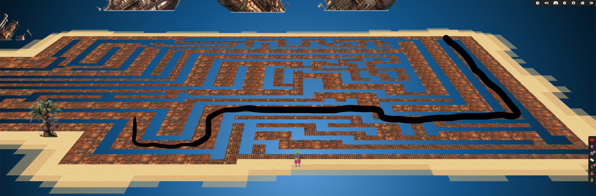
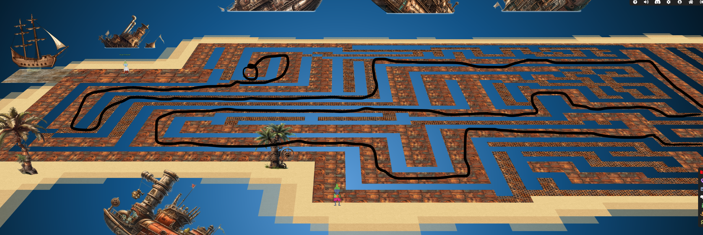
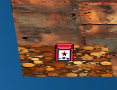
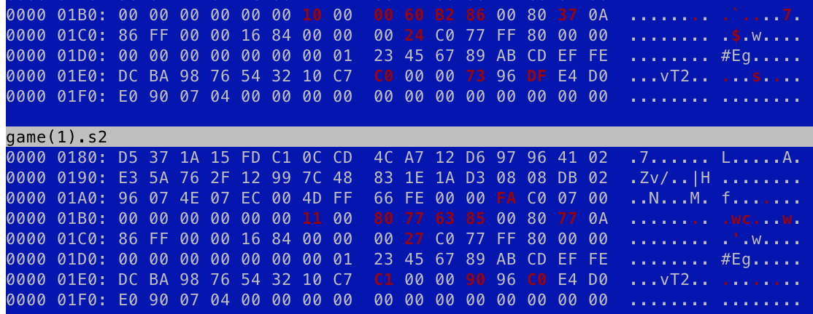
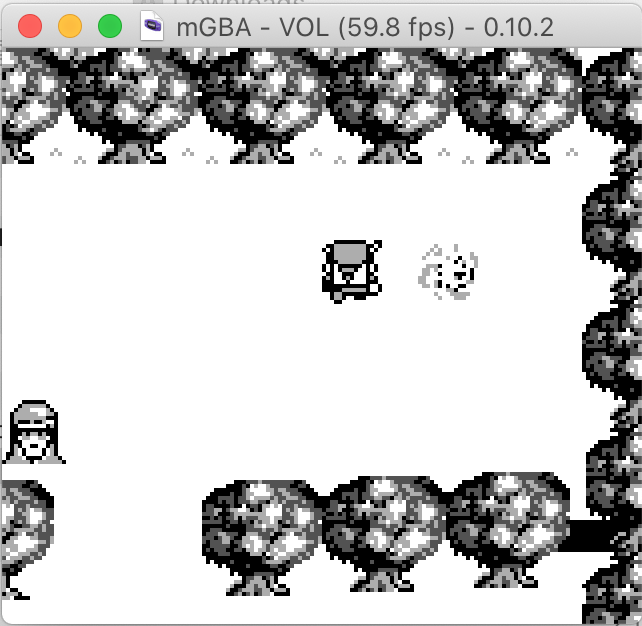
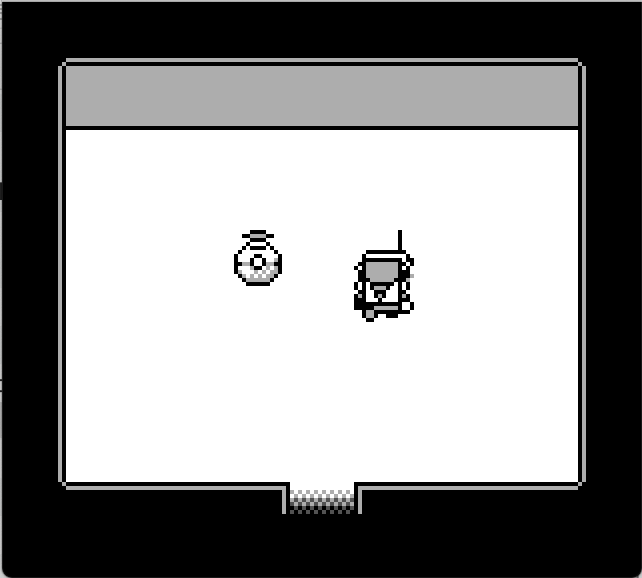

# Game Cartridges: Vol 2

**Difficulty**: :material-pine-tree-variant::material-pine-tree-variant::material-pine-tree-variant::material-pine-tree-variant-outline::material-pine-tree-variant-outline: 
**Direct link**: [Vol II](https://gamegosling.com/vol2-akHB27gg6pN0/index.html?&challenge=gameboy2)

## Objective

!!! question "Request"
    Find the second Gamegosling cartridge and beat the game

??? quote "Angel Candysalt"
    The name's Angel Candysalt, the great treasure hunter! 
    A euphemism? No, why do people always ask me that?? 
    Anyways, I came here to nab the treasure hidden in this ship graveyard, only to discover it's protected by this rusted maze. 
    That must be why all these old ships are here. Their crew came to find the treasure, only to get lost in the labrynth. 
    At least it's obvious where this one is. See that shiny spot over to the right? That's gotta be where it is! If only I had a bird's eye view. 
    But how to get there? Up? Down? Left? Right? Oh well, that's your problem now! 
    Come back if you can find your way to it, and I'll tell you some secrets I've heard about this one. 

## Hints

??? tip "Gameboy 2"
    Try poking around Pixel Island. There really aren't many places you can go here, so try stepping everywhere and see what you get!

??? tip "Gameboy 2"
    1) This feels the same, but different! 2) If it feels like you are going crazy, you probably are! Or maybe, just maybe, you've not yet figured out where the hidden ROM is hiding. 3) I think I may need to get a DIFFerent perspective. 4) I wonder if someone can give me a few pointers to swap.

## Solution

### Find the cartridge

We find Angel Candysalt in Rusty Quay who tells us that the cartridge is in the middle of a maze. Fortunately, we can zoom out in the browser to see the whole path:

### Download the game

After we collect the game, we can try to play it but we get stopped by T-Wiz who won't let us progress. So we're obviously going to have to change something about the game to get through... We should start by investigating how the game works.

By looking at the developer tools in the browser, we can see it's run using web assembly. But alongside the javascript, html and webassembly scripts, there's also a request for [game0.gb](https://gamegosling.com/vol2-akHB27gg6pN0/rom/game0.gb). Searching for the extension shows it's [a Game Boy Rom file](https://fileinfo.com/extension/gb) so perhaps we can run it in an emulator and hack it that way?

### Two versions?!

Before we do so, the naming is a bit interesting `game0.gb`. I wonder if there are other versions? If we try the same url but with `game.gb`, `game1.gb` and `game2.gb`, we see that there are in fact two versions.

??? quote "Tinsel Upatree"
    Did you know that many games had multiple versions released? Word is: volume 2 has 2 versions!

When we play the other version, it appears exactly the same but flipped upside down. I wonder what else is different?
Since we can't get any further, we should try just comparing the bytes:

If we just start slowly changing the bytes from game0 to those in game1, perhaps that will make T-Wiz move?

??? tip "Hex Editors"
    Most editors should be able to let you change the bytes. I normally use VSCode for viewing hex but it didn't seem great at letting you compare bytes though. [vbindiff](https://github.com/madsen/vbindiff) and [hexfiend](http://hexfiend.com/) both seemed pretty good.

Instead of moving T-Wiz, by starting from top-to-bottom, we end up moving the end goal to be above T-Wiz where we can reach it:

### The final challenge

After entering the portal, we end up in a room with what looks like a pokeball and a radio.

We need our volume on for this bit because talking to them just emits a series of beeps that sound an awful lot like morsecode to me... 
I don't understand morsecode, so manually translating it, or even just recording it, wasn't an option for me. We could probably pull the data from the game somehow, but it's easier to record sound through something like Quicktime player or a phone:

[The morsecode](../img/misc/morsecode.mp3)

There are plenty of [online sites](https://morsecode.world/international/decoder/audio-decoder-adaptive.html) that will take that input and translate it for us:

!!! quote "T E S T T T T T T T T T T T T R Y G L 0 R Y G L 0 R Y G L 0 R Y G L 0 R Y G L 0 R Y G L 0 R Y G L 0 R Y G L 0 R Y G L 0 R Y G L 0 R Y G R"

!!! success "Answer"
    GL0RY

## Response

!!! quote "Angel Candysalt"
    The life of a treasure hunter isn't easy, but it sure is exciting! 
    Oh it's a video game, I love video games! But you've claimed this treasure, nicely done. 
    Now, about those secrets I've been told. They're pretty cryptic, but they are. Hopefully that helps with something! 
    You have all three? Wow, you must be the greatest treasure hunter that ever lived!
