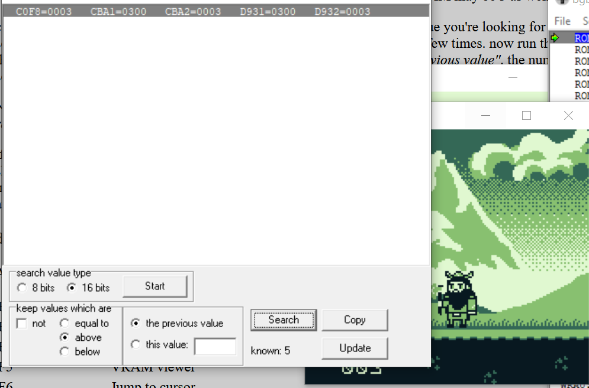
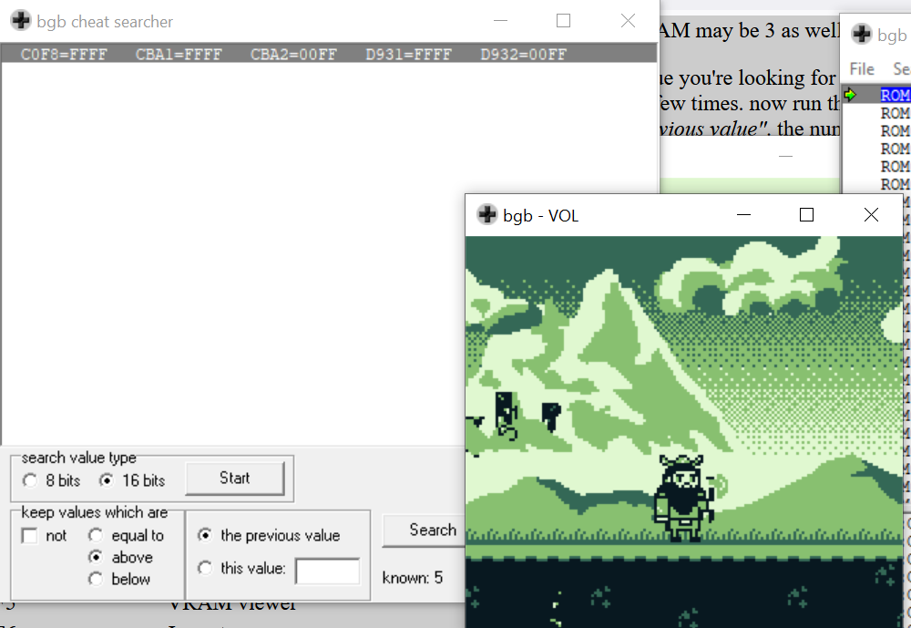
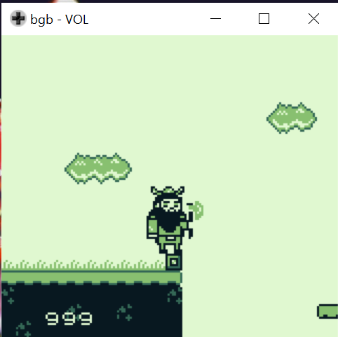
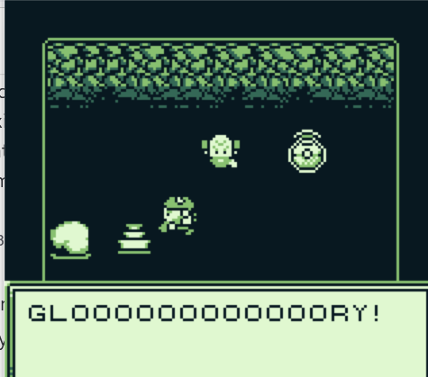
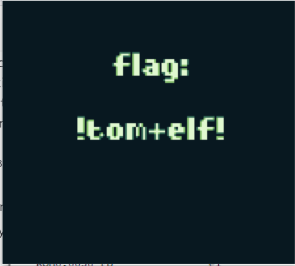

# Game Cartridges: Vol 3

**Difficulty**: :material-pine-tree-variant::material-pine-tree-variant::material-pine-tree-variant::material-pine-tree-variant-outline::material-pine-tree-variant-outline: 
**Direct link**: [Vol III](https://gamegosling.com/vol3-7bNwQKGBFNGQT1/index.html?&challenge=gameboy3)
 
## Objective

!!! question "Request"
    Find the third Gamegosling cartridge and beat the game

??? quote "Tinsel Upatree"
    I can't believe I was actually able to find this underground cavern! 
    I discovered what looked liike an old pirate map in the attic of one of those huts in Rainraster Cliffs, and it actually led somewhere! 
    But now that I've seen where it leads, I think this might've been a bad idea. This place is scary! Maybe you want to take it from here? 
    I'm sure that cartridge is right nearby. Start walking around! 
    Once you run into it, check back with me and I'll tell you what I know about winning. 
    Good luck!
    

## Hints

??? tip "Gameboy 2"
    1) This one is a bit long, it never hurts to save your progress! 2) 8bit systems have much smaller registers than you're used to. 3) Isn't this great?!? The coins are OVERFLOWing in their abundance.

## Solution

The cartridge is once again duck-shaped and is found pretty easily by walking across to the left of Driftbit Grotto

Like in the previous objective, we want to open this one in our own emulator so we first download the `game.gb`.

??? tip "Ghidra"
    I originally tried to solve this by using Ghidra to look for the overflow message and to figure out where that was called from. You can probably do that if you set Ghidra up to run the emulation (there are guides of how online), but it's not the easiest approach since the static decompilation couldn't find references to the string. It also confused me since I saw some of the later-game strings and expected Jared to change his message when I had the correct score.

Playing through this game normally, we'll eventually see the coins overflow after reaching 998 and we'll also see Jared talk about how back in his day, it was "three nines". That seems to imply the goal is to get a score of 999, but how?

??? tip "The Manual Option"
    I originally tried saving the state file with different values and comparing to find which had changed. But a lot of values change (and equally, a lot remain the same) so it's a bit tedious to do manually. I thought about programming something to automatically find the bytes, but fortunately that's already been done for me!

The easiest way to solve this is to open the game in BGB and follow their [cheat searcher guide](https://bgb.bircd.org/manual.html#cheatsearcher)

??? tip "Cheat searching"
    Open the game in BGB and then open the cheat searcher by choosing right-click > other > cheat searcher. You can try 8 bit values, since those would make sense, but I found 16 bit values worked better. Click start and then wander around a bit without collecting coins. Make sure `values not equal to` is selected and periodically click `search`. Now, collect 1, 10 and 100 coins so that your score is `111`. This means that the value will be preserved regardless of whether the data is stored in one byte or separately (it's stored separately). Make sure values `above the previous value` is selected and click `search`. Go back and save so that your score returns to 0. Make sure `values below the previous value` is selected, and click `search`.
    You should find about five values are left.
    Modify each of these values to be 9 by right clicking the value > go here in debugger. Right click > freeze RAM address and enter 09.

After we've found the RAM values and updated them to 9, change areas in the game and we'll see our score is now 999.

??? tip "Glitches"
    You'll need to update more than just the three values shown as the score which is why we don't filter down to only three. If you don't, the game is still playable and winnable, but the images get a bit broken and you have to 'guess' where the different objects are.
    If you try to set the values to their max ('FF'), things also get glitchy.
    

Now when we continue to the "end" of the game, we see a platform has appeared.

??? tip "Save State"
    It's pretty easy to mess up this jump (and the entire game, really), so using the state save and quick load saved a lot of my sanity, especially before this jump!

After we leap over the two platforms and bypass or kill one more enemy, we get to the final room. If we've updated the values correctly, we see the game as intended. If not, we see half-images scattered over the room, but we can win anyway by ignoring the visual input and just treating them as if they are displayed as intended.

!!! success "Answer"
    !tom+elf!

## Response

!!! quote "Tinsel Upatree"
    Whoa, you found it! 
    What version is it? 
    Did you know that many games had multiple versions released? Word is: volume 2 has 2 versions! 
    You have all three? What a glorious collection!
