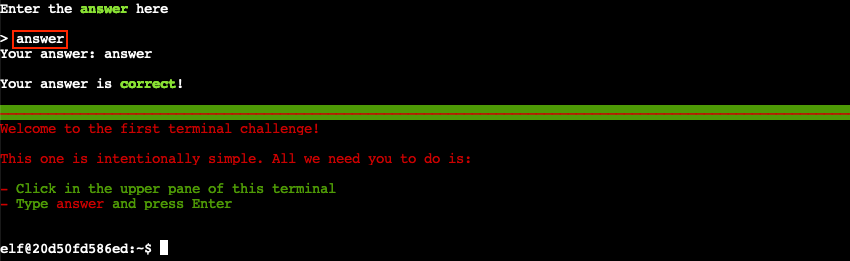

# Na'an

**Difficulty**: :material-pine-tree-variant::material-pine-tree-variant::material-pine-tree-variant-outline::material-pine-tree-variant-outline::material-pine-tree-variant-outline:<br/>
**Direct link**: [nannannannannannan](https://nannannannannannan.com/?&challenge=naan)

## Objective

!!! question "Request"
    Shifty McShuffles is hustling cards on Film Noir Island. Outwit that meddling elf and win!

??? quote "Shifty McShuffles"
    Hey there, stranger! Fancy a game of cards? Luck's on your side today, I can feel it.<br/>
    Step right up, test your wit! These cards could be your ticket to fortune.<br/>
    Trust me, I've got a good eye for winners, and you've got the look of luck about you.<br/>
    Plus, I'd wager you've never played this game before, as this isn't any ordinary deck of cards. It's made with [Python](https://www.tenable.com/blog/python-nan-injection).<br/>
    The name of the game is to bamboozle the dealer.<br/>
    So whad'ya think? Are you clever enough?<br/>

## Hints

??? tip "The Upper Hand"
    Shifty said his deck of cards is made with Python. Surely there's a [weakness](https://www.tenable.com/blog/python-nan-injection) to give you the upper hand in his game.

??? tip "Stump the Chump"
    Try to outsmart Shifty by sending him an error he may not understand.

## Solution

This is a pretty simple game; you choose five unique numbers from 0-9. Whoever picks the lowest and highest number gets a point for each, but any numbers that you both pick are cancelled out.

In theory, no one should ever win or lose: as long as you choose the numbers strategically, you can guarantee the other player cannot get both the highest and lowest numbers (eg the two lowest and two highest + whatever, or the three lowest + highest + whatever, etc).

My first thought, before looking at the hints, was to attempt fractional numbers since they're technically allowed according to the rules. Unfortunately Shifty rejects these, along with negative numbers or obvious non-numbers.

A previous Sans Holiday Hack talk discussed how NaN causes issues for Python when sorting arrays, so that's an option:

```python
>>> x = float("NaN")
>>> x < 0
False
>>> x > 0
False
```

And indeed, inputting 'NaN' along with any four other numbers gets us a win



??? Inf
    In theory, "inf" should be allowed by Python for the same reason "nan" is.
    ```python
    >>> float("inf")
    inf
    ```

    However, it's blocked by the JavaScript:
    ```javascript
    function IsValid(text) {
        return Boolean(text.match(/^[n0-9][na]{0,2}$/ig))
    }
    ```
    Modifying the network request also returns an error message, so it doesn't seem like the program is running Python quite as literally as I'd expected. If I had more time, I would have loved to dive into it further.

## Response

!!! quote "Shifty McShuffles"
    Well, you sure are more clever than most of the tourists that show up here.<br/>
    I couldn't swindle ya, but don't go telling everyone how you beat me!<br/>
    An elf's gotta put food on the table somehow, and I'm doing the best I can with what I got.<br/>
