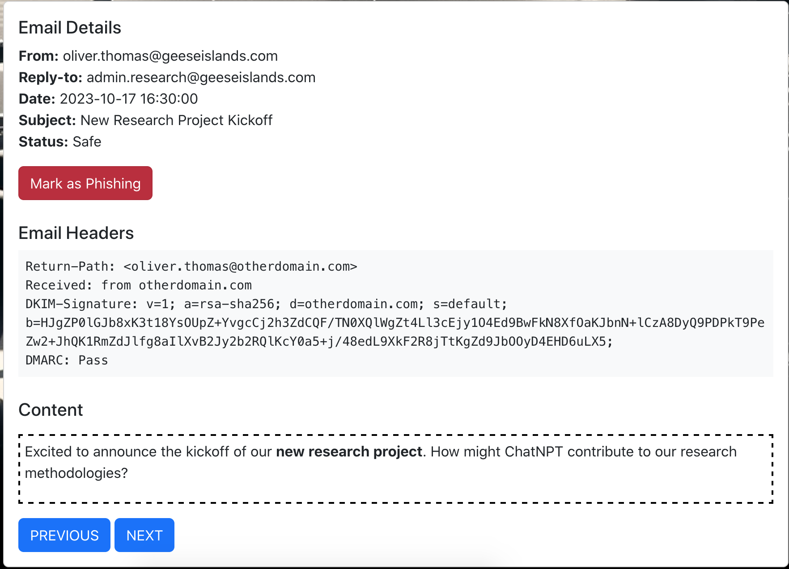

# Phish Detection Agency

**Difficulty**: :material-pine-tree-variant::material-pine-tree-variant::material-pine-tree-variant-outline::material-pine-tree-variant-outline::material-pine-tree-variant-outline: 
**Direct link**: [Phish Detect](https://hhc23-phishdetect-dot-holidayhack2023.ue.r.appspot.com/?&challenge=phishdetect)

## Objective

!!! question "Request"
    Fitzy Shortstack on Film Noir Island needs help battling dastardly phishers. Help sort the good from the bad!

??? quote "Fitzy Shortstack"
    Just my luck, I thought... 
    A cybersecurity incident right in the middle of this stakeout. 
    Seems we have a flood of unusual emails coming in through ChatNPT. 
    Got a nagging suspicion it isn't catching all the fishy ones. 
    You're our phishing specialist right? Could use your expertise in looking through the output of ChatNPT. 
    Not suggesting a full-blown forensic analysis, just mark the ones screaming digital fraud. 
    We're looking at all this raw data, but sometimes, it takes a keen human eye to separate the chaff, doesn't it? 
    I need to get more powdered sugar for my donuts, so do ping me when you have something concrete on this.

## Hints

??? tip "DMARC, DKIM, and SPF, oh my!"
    Discover the essentials of email security with DMARC, DKIM, and SPF at [Cloudflare's Guide](https://www.cloudflare.com/learning/email-security/dmarc-dkim-spf/).

## Solution

We can see from the DNS record, that emails should come from mail.geeseislands.com, pass DKIM and be mailed to dmarc-reports@geeseislands.com if they don't.

So for this challenge, we can just go into the inbox and read through the emails one by one. If they fail DKIM or aren't `Received: from mail.geeseislands.com`, mark them as a phish. If they pass DKIM and are received from mail.geeseislands, mark them as safe.

For example, the following has been incorrectly marked as a phish:

While this one has been incorrectly marked as safe:

## Response

!!! quote "Fitzy Shortstack"
    You've cracked the case! Once again, you've proven yourself to be an invaluable asset in our fight against these digital foes.
