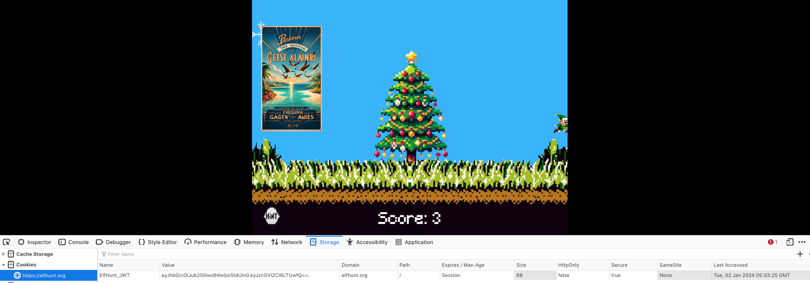
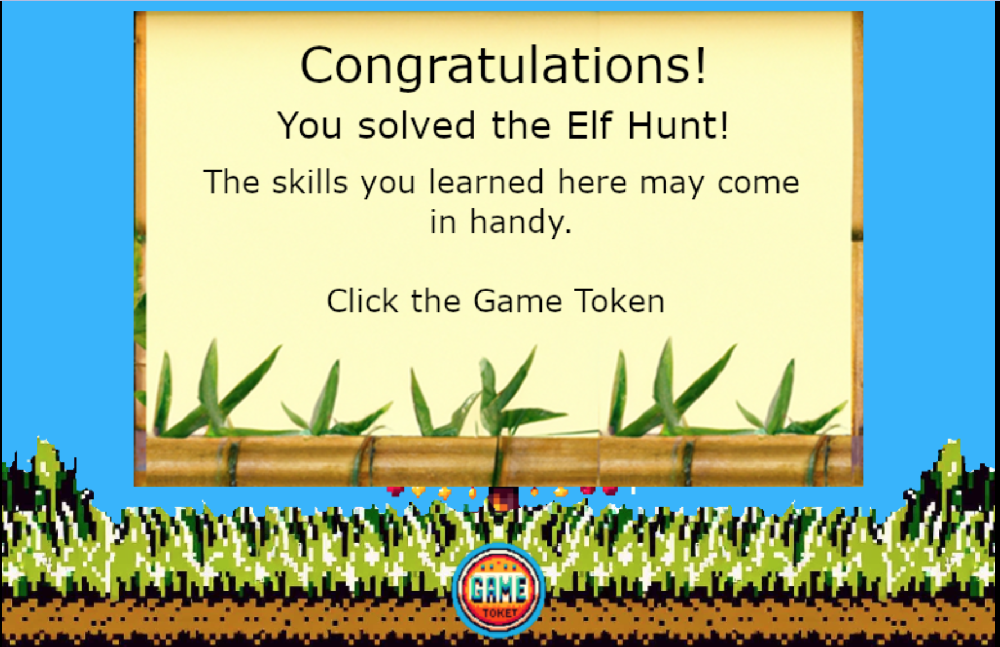

# Elf Hunt

**Difficulty**: :material-pine-tree-variant::material-pine-tree-variant::material-pine-tree-variant::material-pine-tree-variant-outline::material-pine-tree-variant-outline: 
**Direct link**: [Elf Hunt](https://elfhunt.org/?&challenge=elfhunt)

## Objective

!!! question "Request"
    Piney Sappington needs a lesson in JSON web tokens. Hack Elf Hunt and score 75 points.

??? quote "Piney Sappington"
    Hey there, friend! Piney Sappington here.  
    You look like someone who's good with puzzles and games.  
    I could really use your help with this Elf Hunt game I'm stuck on.  
    I think it has something to do with manipulating JWTs, but I'm a bit lost.  
    If you help me out, I might share some juicy secrets I've discovered.  
    Let's just say things around here haven't been exactly... normal.  
    So, what do ya say? Are you in?  
    Oh, brilliant! I just know we'll crack this game together.  
    I can't wait to see what we uncover, and remember, mum's the word!  
    Thanks a bunch! Keep your eyes open and your ears to the ground.

## Hints

??? tip "JWT Secrets Revealed"
    Unlock the mysteries of JWTs with insights from [PortSwigger's JWT Guide](https://portswigger.net/web-security/jwt).

## Solution

Visiting elfhunt.org sets a cookie in our browser `ElfHunt_JWT` with value `eyJhbGciOiJub25lIiwidHlwIjoiSldUIn0.eyJzcGVlZCI6LTUwMH0.` Even ignoring the big JWT hint, it looks an awful look like base64, so let's see what it decodes as:

The JWT consists of three parts separated by `.`:
- The header `eyJhbGciOiJub25lIiwidHlwIjoiSldUIn0` which decodes to `{"alg":"none","typ":"JWT"}`, showing that there's no authentication of the JWT
- The content `eyJzcGVlZCI6LTUwMH0`, which decodes to `{"speed":-500}`
- The signature, which is empty because there is no authentication.

So we can simply change the speed, re-encode it and then update the cookie. From a couple of experiments, setting it to positive seems to make the elves not appear (I assume they go down, off the screen rather than up), and setting it too low makes the game painfully slow.
With a trackpad, a speed of about `-40` seemed about as fast as I could manage and was still pretty slow.

So I recommend setting the speed a bit "higher" (maybe -60) and using a proper mouse.

After playing the game, we get our achievement and a hint for later.

## Response

!!! quote "Piney Sappington"
    Well done! You've brilliantly won Elf Hunt! I couldn't be more thrilled. Keep up the fine work, my friend! 
    What have you found there? The Captain's Journal? Yeah, he comes around a lot. You can find his comms office over at Brass Buoy Port on Steampunk Island.
