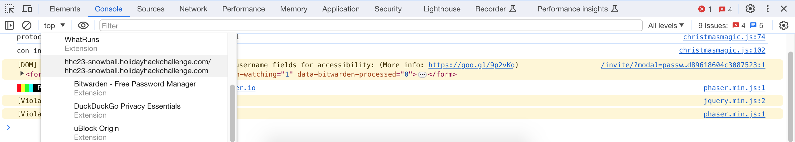
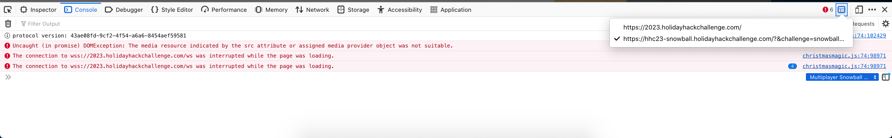
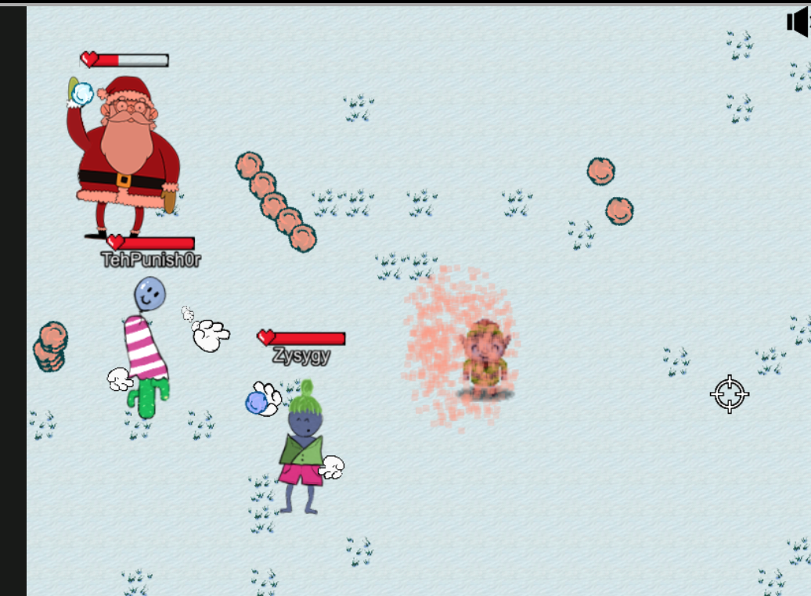
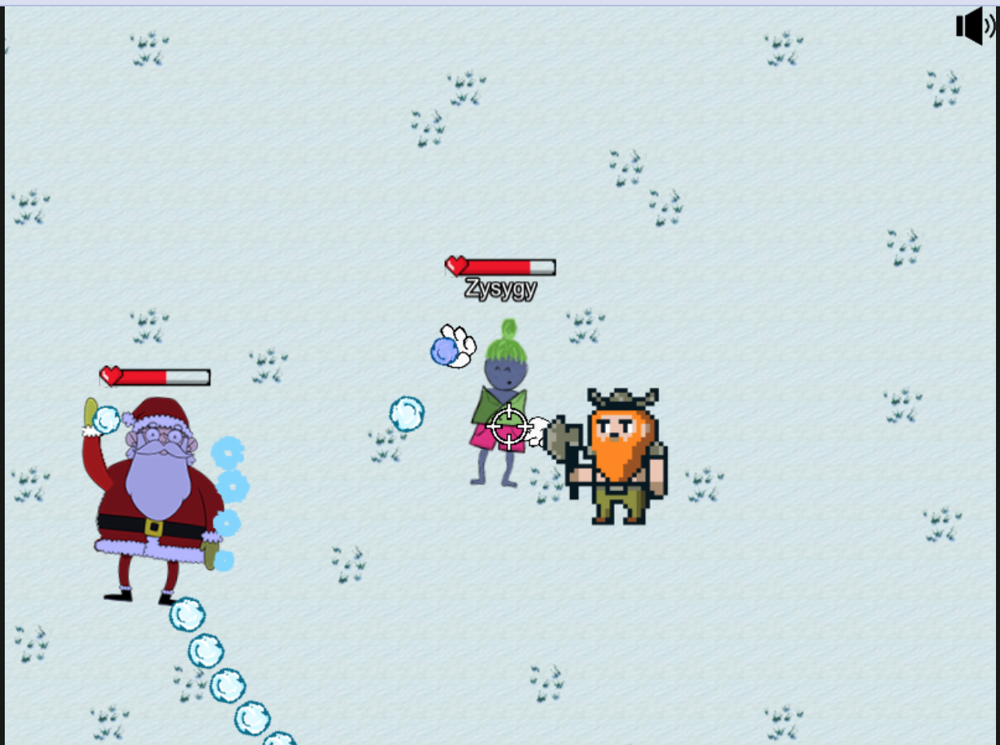
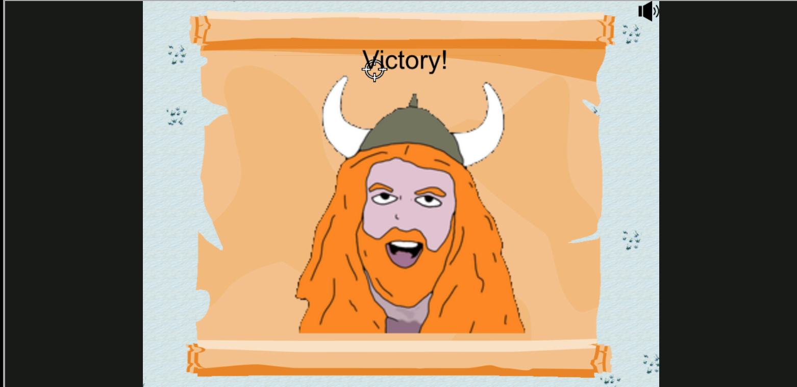

# Snowball Fight

**Difficulty**: :material-pine-tree-variant::material-pine-tree-variant::material-pine-tree-variant-outline::material-pine-tree-variant-outline::material-pine-tree-variant-outline: 
**Direct link**: [Snowball Fight](https://hhc23-snowball.holidayhackchallenge.com/room/?username=drover5&roomId=147656b2c&roomType=public&gameType=co-op&id=6188e3f2-1ead-4281-901a-ce53167b7463&dna=avatar8&singlePlayer=false)

## Objective

!!! question "Request"
    Visit Christmas Island and talk to Morcel Nougat about this great new game. Team up with another player and show Morcel how to win against Santa!

??? quote "Morcel Nougat"
    Hey there, I'm Morcel Nougat, elf extraordinaire! 
    You won't believe this, but we're on a magical tropical island called Christmas Island, and it even has snow! 
    I'm so glad ChatNPT suggested we come here this year! 
    Santa, some elves, and I are having a snowball fight, and we'd love you to join us. Santa's really good, so trust me when I say it's way more fun when played with other people. 
    But hey, if you can figure out a way to play solo by tinkering with client side variables or parameters to go solo mode, go for it! 
    There's also ways to make the elves' snowballs do no damage, and all kinds of other shenanigans, but you didn't hear that from me. 
    Just remember, it's all about having fun and sharing the joy of the holiday season with each other. 
    So, are you in? We'd really love your company in this epic snowball battle! 

## Hints

??? tip "Snowball Super Hero"
    Its easiest to grab a friend play with and beat Santa but tinkering with client-side variables can grant you all kinds of snowball fight super powers. You could even take on Santa and the elves solo!

??? tip "Consoling iFrames"
    Have an iframe in your document? Be sure to select the right context before meddling with JavaScript.

## Solution

There are a number of different ways to solve this challenge; you can just play by the rules (but it will take a *long* time and a lot of luck since Santa is pretty OP), you can increase the damage you do, you can decrease the damage the elves do or you can get help from a certain dwarf.

After opening the snowball fight challenge in an iFrame, open up your developer tools. In the Console window, you need to make sure you're interacting with the snowball fight rather than with
the main holiday hack window.

In Chromium, click the arrow next to "Top" on the top right:

In Firefox click the box-y symbol next to the phone/ipad on the top left:

You can then interact with the NPC characters, making yourself unkillable through something like `player.health = 99999999999`, and making Santa and the elves not attack through things like
`santaThrowDelay = 99999` and `elfThrowDelay = 99999`.

??? tip "Move velocity"
    Setting the move velocity too high makes the game entertaining but not necessarily easier...

Another option is to set `singlePlayer = true` at the start of the game to summon Elf the Dwarf:

and then just hide behind him until Santa is defeated.

## Response

!!! quote "Elf the Dwarf"
    By the twinkling stars and the shimmering snowflakes, you've done it! You bested Santa in a snowball skirmish of epic proportions! The chill in the air now carries the tune of your victory, dancing through the evergreens and telling tales of your frosty valour, I, Elf the Dwarf, hereby crown you the champions of chill, nay the SOVEREIGNS OF SNOW! May your tales of icey conquest be sung by the harth in winters to come so that you may receive... MUCH GLORY!

!!! quote "Morcel Nougat"
    You're like a snowball fighting ninja! A real-life legend. Can I have your autograph!?
