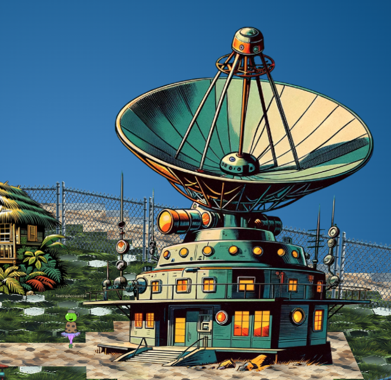

# Camera Access

**Difficulty**: :material-pine-tree-variant::material-pine-tree-variant::material-pine-tree-variant::material-pine-tree-variant-outline::material-pine-tree-variant-outline:<br/>
**Direct link**: [client_container.zip](https://www.holidayhackchallenge.com/2023/client_container.zip) and [NanoSat Christmas Comms](https://nanosat.one/?&challenge=satmissile)

## Objective

!!! question "Request"
    Gain access to Jack's camera. What's the third item on Jack's TODO list?

??? quote "Wombley Cube"
    This is Ground Control, do you read me...? Ground Control to --<br/>
    Hey! How'd you get in here? That tram is the only accessible point of entry and I secured it with MFA!
    No matter, you may have had the skills to find and infiltrate the satellite ground station, but there's no chance you can hack your way into the satellite itself!
    The nanosat's Supervisor Directory will remain hidden, and you'll never discover the mastermind behind all this.
    So don't even waste your time trying.

## Hints

??? tip "Hubris is a Virtue"
    In his hubris, Wombley revealed that he thinks you won't be able to access the satellite's "Supervisor Directory". There must be a good reason he mentioned that specifically, and a way to access it. He also said there's someone else masterminding the whole plot. There must be a way to discover who that is using the nanosat.

## Solution

### Find the Satellite Controller Room and dependencies

For this objective, we need to go up the stairs into the satellite room:



The first step in this challenge is to download the [client_container.zip](https://www.holidayhackchallenge.com/2023/client_container.zip) and follow its README.md to run it in Docker. You can then connect to it using a VNC like they suggest, or by [using NoVNC in your browser](http://localhost:6901/vnc.html).

### Setup 

First, we need to set up WireGuard; open the [NanoSat Christmas Comms](https://nanosat.one/?&challenge=satmissile) terminal behind Wombley, click on the crocodile face and choose `Time Travel`. Give it a couple of minutes to generate WireGuard config and then copy the second set of WireGuard config:

```bash
###BEGIN###
### This is your Wireguard configuration file. Please save it, configure a local Wireguard client, and connect to the Target. ###

<YOUR CONFIG TO COPY IS HERE>

###END####
```

??? tip "Opening applications"
    To open applications on the Docker machine, right-click on the Desktop and then find the application you want. Gedit is good for copying the WireGuard config, but you mostly just need the "Satellite Tools" > "Launch NanoSat MO Base Station Tool"

If you're using Windows or Linux, you should be able to set up WireGuard in the Docker container by saving that config in `/etc/wireguard/wg0.conf` and then running `wg-quick up wg0`. If you're running on MacOS, you may need to install WireGuard on your host machine and then set it up there.

After WireGuard is running, you can confirm it's working correctly by using curl in the Docker container:
```bash
$ curl 10.1.1.1:1024 -v
```
It's not running HTTP so you won't get a response, but curl will say `Connected to 10.1.1.1` if WireGuard is configured correctly and `Failed to connect` otherwise.

### Start the camera

Now we can start actually communicating with the satellite. First, connect to it by opening the "NanoSat MO Base Station Tool" and fetching information from `maltcp://10.1.1.1:1024/nanosat-mo-supervisor-Directory` as specified in the Readme:


Connect to the supervisor by selecting it in the "providers" list on the left and choosing "Connect to Selected Provider".
In the "App Launcher Service", we can see no apps are running so we'll need to start the camera by selecting it and then choosing "runApp". 


### Take a photo

Once the camera says it is running, go back to the "Communications Settings Directory" and "fetch information" again. Now we can select and connect to the camera like we did previously with the supervisor. 


In the camera provider, the "Parameter Service" tab lets us fetch information from the camera. Unfortunately, the "NumberOfSnapsTaken" is 0, so I guess we'll need to take one:


We can do that in the "Action Service" tab by clicking on the "Base64SnapImage" row, clicking "Submit Image" and using the default values. Now when we go back to the "Parameter Service", we can see that "NumberOfSnapsTaken" is 1, so we just need to retrieve the photo.

### Retrieve the photo

If we select the "Base64SnapImage" and run the "getValue" command, we do get back the base64 of the picture, but the GUI makes it completely unusable:


so we have to figure out another way to get it. We know that the satellite is sending it over `maltcp`, we know from [Henry Reed's space talk](http://www.youtube.com/watch?v=qQaA1w6WjGw) that satellite comms are often unencrypted and the Docker container has WireShark installed, so that seems like a probable next step.

Start WireShark running on wg0 and request the image again. Once it's received, stop WireGuard and save the PCAP so you have something like [this pcap](../img/misc/wg1.pcapng).

??? warning "Clipboard limits"
    Originally, I tried copy-pasting from WireShark in the container but there were clipboard limits with my VNC client so I only got a partial broken start of the image: 

Copy the pcap across to your host machine using [Docker's cp command](https://docs.docker.com/engine/reference/commandline/cp/), open it in WireShark and right-click and choose "Follow TCP Stream". Once all the packets have loaded (~967 server packets), you can right-click, select all and copy the data. Paste it into [CyberChef](https://gchq.github.io/CyberChef/#recipe=From_Base64('A-Za-z0-9%2B/%3D',true,false)) and remove the initial preamble so you're just left with the PNG Base64 (which starts with `/9j/`):


When you go to save the output, Cyberchef will detect it as a jpg file:


!!! success "Answer"
    Conquer Holiday Season!


## Response

!!! quote "Wombley Cube"
    A fellow sabateur, are you? Or just a misguided hero-wannabe?<br/>
    You think you're saving the holiday season, but you're meddling in something you could never understand!<br/>
    Yes, I sided with Jack, because Santa's betrayed the elves by forcing us to move our operations to these islands!<br/>
    He put the entire holiday season at risk, and I could not allow this, I had to do something.<br/>
    Knowing my skillset, Jack secretly informed me of his plan to show Santa the error of his ways, and recruited me to aid his mission.<br/>
    Why tell you all this? Because it won't change anything. Everything is already in motion, and you're too late.<br/>
    Plus, the satellite is state-of-the-art, and -- oh drat, did I leave the admin tools open?<br/>
    For some reason, I can't move when you're nearby, but if I could, I would surely stop you!<br/>
