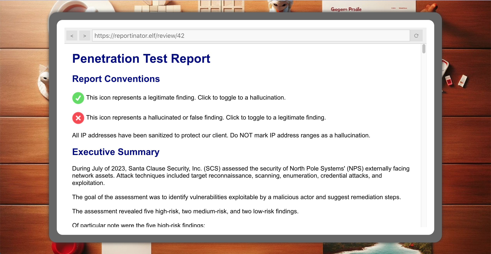
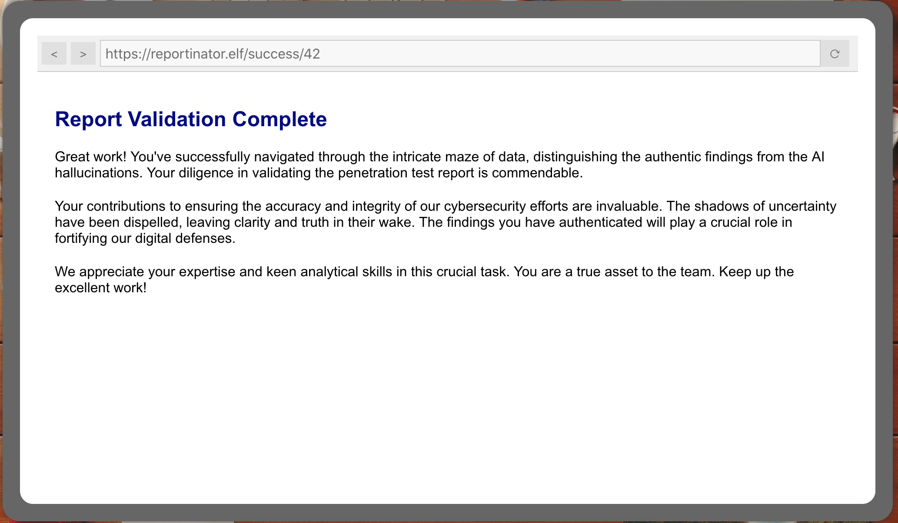

# Reportinator

**Difficulty**: :material-pine-tree-variant::material-pine-tree-variant::material-pine-tree-variant-outline::material-pine-tree-variant-outline::material-pine-tree-variant-outline: 
**Direct link**: [Reportinator](https://hhc23-reportinator-dot-holidayhack2023.ue.r.appspot.com/?&challenge=reportinator)

## Objective

!!! question "Request"
    Noel Boetie used ChatNPT to write a pentest report. Go to Christmas Island and help him clean it up.

??? quote "Noel Boetie"
    Hey there, Noel Boetie speaking! I recently tried using ChatNPT to generate my penetration testing report. 
    It's a pretty nifty tool, but there are a few issues in the output that I've noticed. 
    I need some guidance in finding any errors in the way it generated the content, especially those odd hallucinations in the LLM output. 
    I know it's not perfect, but I'd really appreciate the extra eyes on this one. 
    Some of the issues might be subtle, so don't be afraid to dig deep and ask for further clarification if you're unsure. 
    I've heard that you folks are experts about LLM outputs and their common issues, so I trust you can help me with this. 
    Your input will be invaluable to me, so please feel free to share any insights or findings you may have. 
    I'm looking forward to working with you all and improving the quality of the ChatNPT-generated penetration testing report. 
    Thanks in advance for your help! I truly appreciate it! Let's make this report the best it can be! 

## Hints

??? tip "Reportinator"
    I know AI sometimes can get specifics wrong unless the prompts are well written. Maybe chatNPT made some mistakes here.

## Solution

Initially, I tried solving this by reading the reports and looking for flaws but it seemed to me there were minor mistakes in most of the findings:
1. `certipy find -vulnerable` identifies a variety of vulnerabilities, not just when a client can supply their own SAN
2. The photo doesn't seem like a great choice given it's generic and not tailored to the actual pentest
3. Listing 1 doesn't actually show anything about the AppData table
5. `az keyvault show` does not appear to take a `vault-name` parameter: https://learn.microsoft.com/en-us/cli/azure/keyvault?view=azure-cli-latest#az-keyvault-show
6. The report seems to imply there's an HTTP SEND method when it presumably just means GET
9. Talks about "HTTP 7.4.33 request" which seems to be ChatNPT getting confused by the PhP version.

After trying to flag all of these and being told it was wrong, and then trying a few less-strict options and still getting the answer wrong, I resorted to the brute-force attempt and intercepted
a submission in Burp.
In the "intruder" settings, flag all of the inputs, choose the "cluster bomb" attack mode with values 0 and 1, and you'll find that the correct answer is:
`input-1=0&input-2=0&input-3=1&input-4=0&input-5=0&input-6=1&input-7=0&input-8=0&input-9=1`

That means that only findings 3, 6 and 9 are invalid which seems reasonable - my issue with the first and second findings are just me being finnicky, and maybe there is an old version of `az` that took a vault-name parameter (or maybe Azure docs just aren't great).

## Response

!!! quote "Noel Boetie"
    Great job on completing that challenge! Ever thought about how your newfound skills might come into play later on? Keep that mind sharp, and remember, today's victories are tomorrow's strategies!
