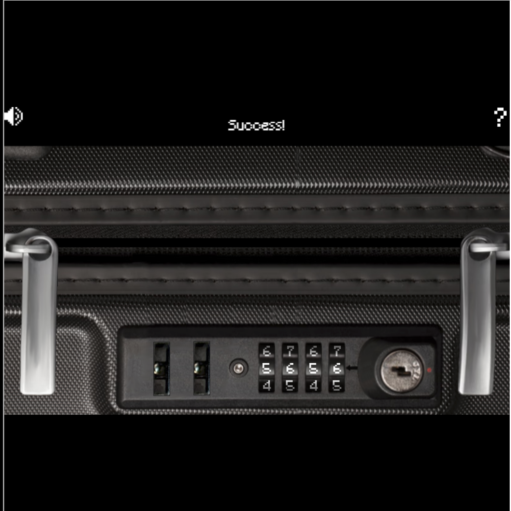
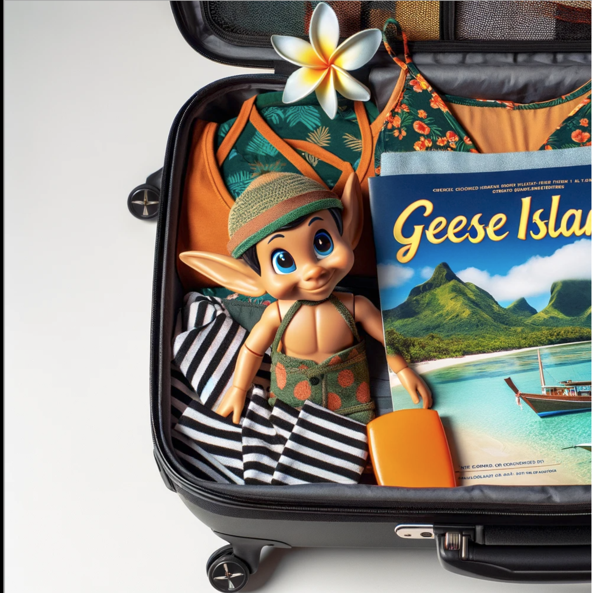

# Luggage Lock

**Difficulty**: :material-pine-tree-variant::material-pine-tree-variant-outline::material-pine-tree-variant-outline::material-pine-tree-variant-outline::material-pine-tree-variant-outline: 
**Direct link**: [Luggage Lock](https://lockdecode.com/?&challenge=lockdecode)

## Objective

!!! question "Request"
    Help Garland Candlesticks on the Island of Misfit Toys get back into his luggage by finding the correct position for all four dials

??? quote "Garland Candlesticks"
    Hey there, I'm Garland Candlesticks! I could really use your help with something. 
    You see, I have this important pamphlet in my luggage, but I just can't remember the combination to open it! 
    Chris Elgee gave a talk recently that might help me with this problem. Did you attend that? 
    I seem to recall Chris mentioning a technique to figure out the combinations... 
    I have faith in you! We'll get that luggage open in no time. 
    This pamphlet is crucial for me, so I can't thank you enough for your assistance. 
    Once we retrieve it, I promise to treat you to a frosty snack on me! 

## Hints

??? tip "Lock Talk"
    Check out Chris Elgee's [talk](https://youtu.be/ycM1hBSEyog) regarding his and his wife's luggage. Sounds weird but interesting!

## Solution

There doesn't seem to be an easy way to solve this; just hold the lock button slightly down and scroll through the numbers using `qwer` and `asdf`. The locks will stick in multiple places, but they'll mostly stick around the `8`, `6` `0` and `2`

After entering those numbers, push the lock all the way in to see the bag unlock:

## Response

!!! quote "Garland Candlesticks"
    Wow, you did it! I knew you could crack the code. Thank you so much!
