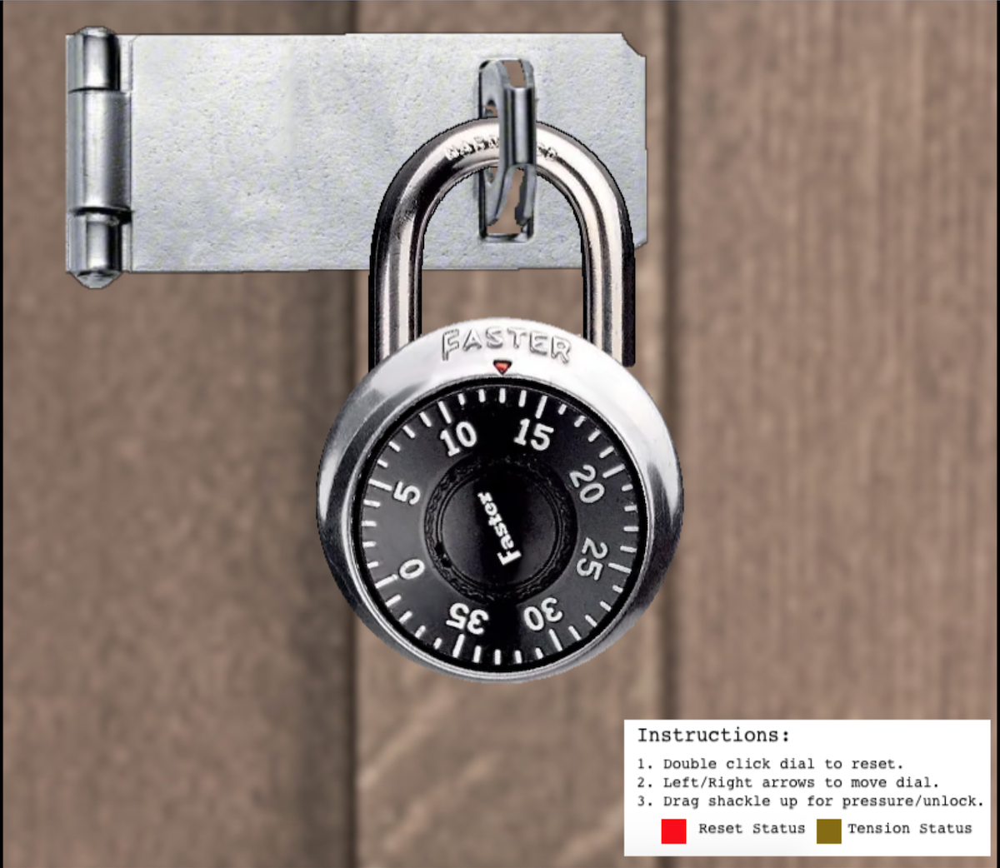

# Faster Lock Combination

**Difficulty**: :material-pine-tree-variant::material-pine-tree-variant::material-pine-tree-variant-outline::material-pine-tree-variant-outline::material-pine-tree-variant-outline: 
**Direct link**: [Faster Lock](https://paddlelockdecode.com/?&challenge=fasterlock)

## Objective

!!! question "Request"
    Over on Steampunk Island, Bow Ninecandle is having trouble opening a padlock. Do some research and see if you can help open it!

??? quote "Bow Ninecandle"
    Hey there! I'm Bow Ninecandle, and I've got a bit of a... 'pressing' situation. 
    You see, I need to get into the lavatory, but here's the twist: it's secured with a combination padlock. 
    Talk about bad timing, right? I could really use your help to figure this out before things get... well, urgent. 
    I'm sure there are some clever tricks and tips floating around [the web](https://www.youtube.com/watch?v=27rE5ZvWLU0) that can help us crack this code without too much of a flush... I mean fuss. 
    Remember, we're aiming for quick and easy solutions here - nothing too complex. 
    Once we've gathered a few possible combinations, let's team up and try them out. 
    I'm crossing my legs - I mean fingers - hoping we can unlock this door soon. 
    After all, everyone knows that the key to holiday happiness is an accessible lavatory! 
    Let's dive into this challenge and hopefully, we won't have to 'hold it' for too long! Ready to help me out? 

## Solution

### Step 1: Find the Sticky Number

Click on the top of the padlock and pull it up slightly to get a little bit of tension. Spin the lock with the arrow keys until it starts to slow down at a specific number:

Record this as your sticky number. For me, it was 13, but it changes each time.

### Step 2: Find the Guess Numbers

To find the sticky numbers, move the lock back down to 35. Now, put a lot of tension on the lock so that it barely moves (the status should be dark red). If it gets stuck at half increments around a number, record the middle number. If it gets stuck on full numbers, release some tension and move it up half a number. You should find two numbers it gets stuck on in the 35 - 10 range (widen your search otherwise).

My magic numbers were 3 and 8.

### Step 3: Calculate the first digit

MAGIC_NUMBER + 5. So for me, 17

### Step 4: Calculate the last digit

We need to figure out:

    a. FIRST_DIGIT % 4.
    b. magic number, magic number + 10, magic number + 20, magic number + 30
    c. magic number 2 , magic number 2 + 10, magic number 2 + 20, magic number 2 + 30
    d. Which of the results of a and c % 4 == a

So for me, that's:

    a. 17 % 4 = 1

       | Magic number  | MN + 10  | MN + 20  | MN + 30  |
    b. | 3             | 13       | 23       | 33       |
    c. | 8             | 18       | 28       | 38       |

    d. 13 and 33

Then put heavy tension on your lock and move it around those two numbers. The looser one is your second number; for me, that's 33.

### Step 5: Calculate the middle digit possibilities

| Initial           | + 2   |  + 10 | + 18 | + 26 | + 34 |
| :---------------- | :-----| :---- | :----| :----| :----|
| Remainder (1)     | 3     |  11   | 19   | 27   | 35 |
| Remainder + 4 (5) | 7     |  15   | 23   | 31   | 39 |

!!! note "If your value is over 39"
    Just let it wrap around, ie val % 39

Eliminate any values within 2 from your first and third digits. So for me, I can eliminate
19 (too close to 17), 35 (too close to 33), 15 (too close to 17) and 31 (too close to 33).

### Step 6: Attempt all the options

Now just attempt all the possibilities:
* 17 3 33
* 17 11 33
* 17 27 33
* 17 7 33
* 17 23 33
* 17 39 33

!!! note "Maybe try twice"
    I was always terrible at opening these sorts of locks; even in high school when I knew the correct combination, it took me a couple of tries 😅

## Response

!!! quote "Bow Ninecandle"
    Oh, thank heavens! You're a lifesaver! With your knack for cracking codes, we've just turned a potential 'loo catastrophe' into a holiday triumph!
