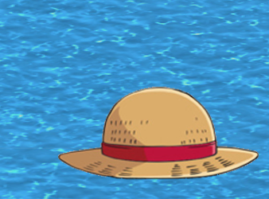
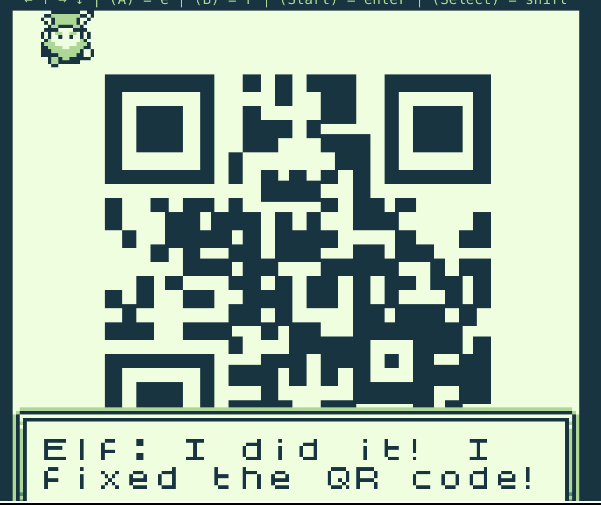

# Game Cartridges: Vol 1

**Difficulty**: :material-pine-tree-variant::material-pine-tree-variant-outline::material-pine-tree-variant-outline::material-pine-tree-variant-outline::material-pine-tree-variant-outline: 
**Direct link**: [Vol 1](https://gamegosling.com/vol1-uWn1t6xv4VKPZ6FN/index.html?&challenge=gameboy1)

## Objective

!!! question "Request"
    Find the first Gamegosling cartridge and beat the game

??? quote "Dusty Giftwrap"
    Arrr, matey, shiver me timbers! There be buried treasure herrrrre. 
    Just kidding, I'm not really a pirate, I was just hoping it would make finding the treasure easier. 
    I guess you heard about the fabled buried treasure, too? I didn't expect to see anyone else here. This uncharted islet was hard to find. 
    There are 3 buried treasures in total, each in its own uncharted area around Geese Islands. 
    I've been searching for hours now with no luck, and these strange toys are starting to give me the creeps. 
    Maybe you'll be able to find it. Here, use my Gameboy Cartridge Detector. Go into your items and test it to make sure it's still working. 
    When you get close to the treasure, it'll start sounding off. The closer you get, the louder the sound. 
    No need to activate or fiddle with it. It just works! 
    I bet one of these creepy toys has the treasure, and I'm sure not going anywhere near them! 
    If you find the treasure, come back and show me, and I'll tell you what I was able to research about it. 

Good luck! 

## Hints

??? tip "Buried Treasure"
    There are 3 buried treasures in total, each in its own uncharted area around Geese Islands. Use the gameboy cartridge detector and listen for the sound it makes when treasure is nearby, which gets louder the closer you are. Also look for some kind of distinguishing mark or feature, which could mark the treasure's location.

??? tip "Approximate Proximity"
    Listen for the gameboy cartridge detector's proximity sound that activates when near buried treasure. It may be worth checking around the strange toys in the Tarnished Trove.

??? tip "Gameboy 1"
    1) Giving things a little push never hurts. 2) Out of sight but not out of ear-shot 3) You think you fixed the QR code? Did you scan it and see where it leads?

## Solution

### Find the game cartridge

We first hear about the games from Dusty Giftwrap on Tarnished Trove, so we go for an explore around there while listening to music so we can hear the distinctive [ching](https://2023.holidayhackchallenge.com/sfx/gameboy_detector.mp3) of the detector when we get near.

What's that duck doing under this hat?!

### Play the game

We don't actually have to do anything technical to solve this challenge. Simply ignore Elf's grumblings about the game problems and walk through to the dog. He explains how to solve the puzzle; push the piece he points out, then there's a block on the very left side of the grid that needs to be pushed out and all the way around to the right of the grid and the rest are all at the bottom of the grid.

??? Warning "order matters"
    The blocks at the bottom of the grid are the only small challenge in this objective. You have to push them in the right order or they'll get stuck. To make things more complicated, when a block is "singing", other blocks will disappear if they're in the target spot.

Once we've put all of the blocks back in place, we see confirmation that we've fixed the blocks and that it's a QR code:

You can upload the image [to a QR decoder](https://qrcoderaptor.com/) or scan it with most phone cameras to see that it's a [URL](https://8bitelf.com/)

!!! success "Answer"
    santaconfusedgivingplanetsqrcode

## Response

!!! quote "Dusty Giftwrap"
    Whoa, you found it! 
    It's a... video game cartridge? Coooooollll... I mean, arrrrrr.... 
    So, here's what my research uncovered. Not sure what it all means, maybe you can make sense of it. 
    You have all three? I think that makes you ruler of the pirates! 
